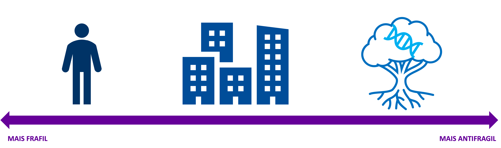
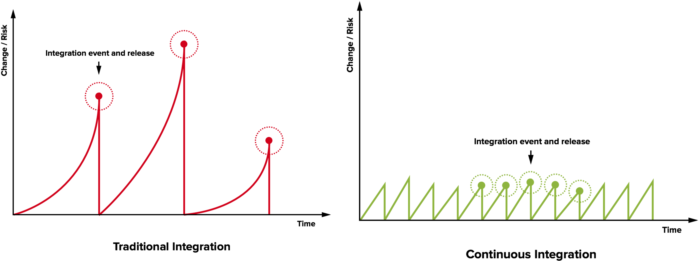

# Além da resiliência: Construindo sistemas que se beneficiam das falhas

Na ultima quarta-feira (18/09/2024) tive a oportunidade de apresentar uma palestra na trilha digital de arquitetura e segurança da Vivo no [TDC 2024](https://thedevelopersconference.rds.land/sp24-vivo). 

O TDC (The Developers Conference) é um dos maiores eventos de tecnologia do Brasil e reúne profissionais de diversas áreas para discutir as tendências e desafios do mercado de tecnologia. A edição de 2024 foi realizada de forma híbrida, com palestras presenciais em São Paulo e online para todo o Brasil.

O tema da palestra foi **"Além da resiliência: Construindo sistemas que se beneficiam das falhas"**. Neste post, vou compartilhar um resumo do conteúdo apresentado.

{/* truncate */}

## Além da Resiliência

Para entender como podemos ir além da resiliência, é importante primeiro entender o que é resiliência. Resiliência é a capacidade de um sistema de se recuperar de falhas e continuar funcionando normalmente. Se pensarmos do ponto de vista do comportamento que um sistema apresenta com relação a falhas ou estresse, podemos classificá-lo em três categorias

- **Os que se quebram**: são sistemas frágeis, que não conseguem lidar com falhas e param de funcionar quando algo dá errado.
- **Os que são inertes**: são sistemas resilientes, que conseguem se recuperar de falhas e continuar funcionando, mas não aprendem com os erros e não melhoram sua capacidade de lidar com falhas no futuro.
- **Os que se beneficiam**: são sistemas antifrágeis, que não apenas se recuperam de falhas, mas também aprendem com elas e melhoram sua capacidade de lidar com falhas no futuro.

Podemos notar que um novo termo surgiu "Antifrágil". Nas próximas sessões esse termo será melhor explorado.

## Antifragilidade

O conceito de antifragilidade foi introduzido por Nassim Nicholas Taleb em seu livro "Antifrágil: Coisas que se beneficiam com o caos". Segundo Taleb, um sistema antifrágil é aquele que se beneficia de falhas e estresse, tornando-se mais forte e mais resiliente à medida que é exposto a eventos adversos.

O termo surgiu quando Taleb não encontrou uma palavra para descrever o oposto de frágil. Ele percebeu que o termo "Robusto" ou "Resiliente" não era suficiente, pois um sistema robusto simplesmente resiste a falhas, enquanto um sistema antifrágil se beneficia delas, e assim como "Neutro" não é o oposto de "Negativo" e sim "Positivo", "Resiliente" não é o oposto de "Frágil" e sim "Antifrágil".

Taleb descreve a antifragilidade como "Qualquer coisa que apresenta mais vantagens a partir de certos impactos, o inverso é frágil" e propõe que é muito mais fácil saber se uma coisa ou situação é frágil do que prever um evento capaz de danifica-la, o que fica muito claro quando imaginamos uma situação de fragilidade, como uma taça de cristal equilibrada em uma mesa, é muito mais fácil prever que ela quebrará se cair do que prever o evento que a fará cair. 

Outro conceito interessante é o de que sistemas complexos enfraquecem e até mesmo morrem quando são privados da exposição a estresse, ou seja, a exposição a eventos adversos é necessária para o crescimento e a evolução de um sistema. Podemos pensar no corpo humano, que se não estiver sempre em movimento, se exercitando e submetendo-se a pequenos níveis de estresse, perde massa muscular e se deteriora com o tempo.

## Indentificando a fragildidade

Agora que definimos o conceito da antifragilidade, podemos explorar alguns outros conceitos que Taleb apresenta em seu livro, como a identificação da fragilidade. Nas próximas sessões, serão apresentados alguns conceitos que podem ser utilizados para identificar a fragilidade.

### Eventos Cisnes Negros
Esse conceito foi introduzido por Taleb no livro "A Lógica do Cisne Negro" publicado em 2007, onde ele destaca que apensar das analises de projeções, sistemas complexos estão sujeitos a reviravoltas imprevisíveis.

O nome Cisnes negros vem pelo fato de que no passado na Europa, tinha-se a crença de que só existiam cisnes brancos, mas com o descobrimento de cisnes negros na Australia, toda essa crença foi por água a baixo. 

Taleb descreve os eventos cisnes negros como eventos altamente impactantes, raros e imprevisíveis. Muitas vezes esses eventos, retrospectivamente são atribuídos a explicações convenientes. Em resumo, são eventos difíceis de prever, mas que precisamos estar sempre preparados. 

### O Peru de Natal
Outro conceito introduzido por Taleb é o Peru de Natal, que é uma metáfora visual para ilustrar a fragilidade. O peru é alimentado todos os dias, bem tratado e protegido, até que chega o dia de Natal, onde ele é morto e servido como jantar. O peru não tem como prever o que acontecerá no dia de Natal, pois todos os dias anteriores foram de prosperidade e bem-estar. Essa metáfora mostra que a "Ausência da evidência não é evidência da ausência", ou seja, precisamos buscar outros pontos de vista e considerar outras possibilidades além das que já conhecemos, pois o que não sabemos pode ser mais importante do que o que sabemos.

### O Problema de Lucrécio
O Problema de Lucrécio é uma analogia que Taleb faz com o poeta romano Lucrécio. Resumidamente, "O tolo acredita que a montanha mais alta do mundo é a montanha que ele viu". O problema de Lucrécio é a crença de que o que não vemos não existe, ou seja, acreditar que o que não conhecemos não é importante. Taleb usa essa analogia para ilustrar que muitas vezes não consideramos o que não conhecemos, e isso pode ser um grande erro, pois o que não conhecemos pode ser mais importante do que o que conhecemos.

Fukushima é um exemplo, pois foi projetada para aguentar o maior terremoto já registrado no Japão, até que um terremoto maior aconteceu e a usina não aguentou. Precisamos estar preparados para o inesperado, pois o inesperado é o que mais nos impacta.

## Técnicas antifrágeis

Nessa seção, serão apresentadas algumas técnicas que o Taleb propõem para aumentar a  antifragilidade de sistemas.

### Exposição controlada (Mitridatização)
Mitridatização é o processo de tornar-se resistente a um veneno, ingerindo pequenas doses do veneno ao longo do tempo. O nome vem de Mithridates VI, um rei Turco, que paranoico pela morte de seu pai por envenenamento, começou a ingerir pequenas doses de veneno para se tornar resistente a ele. Algum tempo depois, Mithridates foi capturado por seus inimigos e tentou se matar tomando veneno, mas não conseguiu, pois seu corpo estava resistente a ele.

Taleb propõe que a exposição controlada a eventos adversos é uma forma de aumentar a antifragilidade de um sistema, assim como o corpo humano, que se torna mais forte quando exposto a pequenos níveis de estresse.

Podemos ver com essa técnica que o antifrágil é um conceito muito antigo que somente não tinha um nome para o descrever.

### Opções assimétricas (Estrategia de Barbell)
A estratégia de barbell é uma técnica que consiste em dividir as opções em dois extremos, um extremamente seguro e o outro extremamente arriscados, evitando o moderado ou que está no centro. Taleb propõe que essa técnica é uma forma de aumentar a antifragilidade de um sistema, pois se um dos extremos falhar, o outro compensará.

A ideia é sempre fazer uma análise do risco associado, tolerando perdas limitadas e tendo aversão a perdas excessivas. Trabalhar de uma forma a potencializar o ganho, e a longo prazo, quando um lado estiver exposto a um evento cisne negro o outro compensa e ganha com essa exposição. 

Aqui sempre precisamos experimentar e inovar, pois enquanto de um lado temos a segurança, do outro precisamos dessa exposição.

### Descentralização e Diversidade
Se pensarmos em um individuo, ele é Antifrágil, pois como vimos, seu corpo se beneficia de pequenos estresses, como por exemplo ir a academia, porém esse individuo ainda é frágil, pois se ele morrer tudo relacionado a ele se vai também. Em contra partida o conjunto de indivíduos, como uma sociedade, é antifrágil, pois se um individuo morrer, a sociedade continua, e se um individuo se beneficia de um estresse, a sociedade como um todo se beneficia.

Um ótimo exemplo de Descentralização e Diversidade é a vida, pois é adaptada aos mais diversos ambientes. E mesmo grandes eventos cisnes negros como cinco extinções em massa, a vida ainda prospera. A máxima "Sistemas complexos enfraquecem e morrem na ausência de estressores" ilustra bem o que acontece na vida, pois sem eventos estressores, como a seleção natural, a vida deixa de evoluir e se adaptar, tornando-a mais suscetível a impactos.

### Redundância planejada
Como vimos, ter redundância é uma ótima abordagem para que sistemas resistam a choques e estresse, porém, somente a redundância não é suficiente para beneficiar um sistema em caso de falha, precisamos planejar a redundância, para que em determinados choques, o sistema possa se recuperar de forma rápida e eficiente e melhorar com isso.

Em alguns pontos do sistema é preciso ter diversos níveis de redundância, porém em outros talvez não precise. Precisamos sempre planejar de uma forma a otimizar os custos envolvidos, a segurança necessária e a capacidade de experimentar e inovar, como vimos nas opções assimétricas. 

### Aprendizado Continuo
Talvez um dos pontos mais importantes quando tratamos de antifragilidade seja a capacidade de aprender com os eventos passados.
Conforme vimos em quase todas as técnicas apresentadas, precisamos sempre experimentar e inovar e para isso precisamos aprender com os erros e acertos. A ideia é sempre melhorar e evoluir.

Podemos pensar nas máximas, "1% melhor a cada dia" ou "Fail fast, learn fast", que ilustram bem o que precisamos fazer para melhorar e evoluir. A ideia é sempre aprender com o que aconteceu, e melhorar a cada dia e para isso precisamos estar em constante aprendizado.

Um exemplo de sucesso é a industria aérea, que a cada incidente aprende com os erros e acertos, e melhora todos os sistemas, tornando-se a cada dia mais segura e eficiente.

## Software Antifrágil
Nesta seção, utilizaremos os conceitos introduzidos por Taleb para explorar como podemos aplicar a antifragilidade em sistemas de software.

### Postmortem
Talvez um dos pontos mais importantes quando falamos de **[aprendizado continuo](#aprendizado-continuo)** sejam os postmortems, pois neles conseguimos compartilhar todo o background de um problema, como ele foi resolvido e o que foi aprendido com ele. A ideia é que não somente os envolvidos possam aprender com o problema, mas também as gerações futuras.

Um postmortem deve contemplar principalmente os seguintes pontos:
- **Cabeçalho**: data, título, autor, versão, revisor, status, tipo, dono, data de revisão, data de aprovação, data de publicação e outras informações relevantes;
- **Sumário executivo**: resumo do problema, impacto, ações tomadas, lições aprendidas e ações futuras;
- **Sumário do problema**: descrição do problema, impacto, cronologia, resolução e ações futuras;
- **Itens de ação**: ações tomadas, ações futuras, responsáveis, prazos e status;
- **Cronologia**: detalhamento do problema, desde o início até a resolução;
- **Lições aprendidas**: o que foi aprendido com o problema;

Claro que não precisa se limitar somente a isso, mas é um bom ponto de partida, o livro do SRE do Google tem um [capítulo](https://sre.google/workbook/postmortem-culture/) inteiro dedicado a isso, vale a pena a leitura.

O postmortem deve ser feito logo após a resolução do problema, para que todos os envolvidos ainda tenham o problema fresco na memória, e deve ser revisado periodicamente para garantir que as ações futuras estão sendo tomadas.

Além disso, é importante que o postmortem seja compartilhado com todos, para que possam aprender com o problema, até mesmo as gerações futuras, que podem se beneficiar e encontrar soluções para problemas parecidos.

:::tip
Em um projeto que participei utilizamos o [docussaurus](/projects/blog/how-to) para criar uma documentação de postmortem, onde todos podiam contribuir com o que aprenderam e o que poderia ter sido feito de forma diferente. Por ser uma ferramenta de documentação como código, conseguimos versionar e revisar os postmortems de forma mais fácil. Além de trabalhar com tags e mecanismos de busca para facilitar a busca de postmortems antigos.
:::

Um ponto importante é deixar claro que o postmortem não é uma ferramenta de punição, mas sim de aprendizado, fazendo uso do blameless postmortem, ponto chave da blameless culture, que exploramos melhor na proxima seção.

### Blameless Culture
Como vimos na seção anterior, um dos pontos principais de construir um bom post-mortem é a blameless culture, ou seja, cultura sem culpa. Também relacionado com a técnica de **[aprendizado continuo](#aprendizado-continuo)**, a blameless culture é um dos pilares para a construção de um ambiente seguro e saudável para a equipe, para que todos possam verdadeiramente aprender com os erros e melhorar continuamente.

Cultura Blameless é uma abordagem organizacional que busca criar um ambiente onde os erros são vistos como oportunidades de aprendizado e melhoria contínua, em vez de motivos para culpar indivíduos. Ao invés de procurar um culpado, o foco está em entender as causas raiz dos problemas e implementar soluções para evitá-los no futuro.

Dentre os principais pontos da cultura blameless, podemos destacar:
- **O que está errado** ao invés de **quem está errado**
- **O problema está no sistema** ao invés de **no indivíduo**
- **Aprender com os erros** ao invés de **punir por eles**
- **Melhoria contínua** ao invés de **culpar por falhas**
- **Transparência** ao invés de **ocultar informações**

Com essas trocas simples conseguimos construir um ambiente mais aberto, empoderado e que podemos aprender com os erros, melhorando o sistema com as falhas.

### GameDay
O gameday é uma forma de **exposição controlada** e **aprendizado contínuo**. A ideia foi popularizada pela Amazon e é uma prática comum em empresas que adotam a cultura DevOps.

No game day, a equipe simula um cenário de falha, um incidente passado ou testam alguma hipótese, para observar como o sistema se comporta e como a equipe reage, com o objetivo de aprendizado e de melhoraria do sistema.

Podemos utilizar o post-mortem tanto para documentar o que foi aprendido e o que pode ser melhorado, como os de eventos passados para reencenar o incidente, fazendo com que toda a equipe aprenda com esse evento.

Devemos sempre tentar trazer uma equipe multidisciplinar e de diferentes areas da empresa para o game day, para que todos possam aprender e contribuir com o aprendizado, disseminando o conhecimento através da organização.

O gameday é muito importante principalmente para validar planos de disaster recovery, testar se o plano está aderente, as automações e backups funcionam, e se toda a equipe tem capacidade e conhecimento para executar o plano em caso de incidente real.

O gameday é uma oportunidade de aprender com as falhas antes que elas de fato aconteçam, e de melhorar o sistema e a equipe continuamente.

### Continuous integration / Continuous Delivery  (CI/CD)
Um dos pilares da cultura DevOps, o CI/CD muitas vezes é confundido com somente automatizar a entrega de software ou com ferramentas, mas na verdade é muito mais do que isso e tem relação com a técnica de **[exposição controlada](#exposição-controlada-mitridatização)**.

O CI (Continuous integration) é uma prática de desenvolvimento de software onde cada desenvolvedor mescla suas alterações em uma base de código junto com as alterações de seus colegas **pelo menos diariamente**. Cada uma dessas integrações é verificada por uma construção automatizada (incluindo teste) para detectar erros de integração o mais rápido possível. As equipes descobrem que essa abordagem reduz o risco de atrasos na entrega, reduz o esforço de integração e permite práticas que promovem uma base de código saudável para aprimoramento rápido com novos recursos [ref](https://martinfowler.com/articles/continuousIntegration.html).

O CD (Continuous Delivery) é uma abordagem de desenvolvimento de software na qual as equipes produzem software em ciclos curtos, garantindo que o software possa ser lançado a qualquer momento. Isso é feito garantindo que o código esteja sempre em um estado de lançamento, ou seja, qualquer commit que entra na base de código principal é automaticamente implantado em um ambiente de teste e, em seguida, em produção. O objetivo é criar um processo de implantação confiável e repetível, permitindo que as equipes construam, testem e implantem software com mais frequência e confiança [ref](https://martinfowler.com/bliki/ContinuousDelivery.html).

Como vimos pelas definições e quase como na Mitridatização, onde tomamos **pequenas** doses de venenos diariamente, do que uma grande quantidade eventualmente. Então, além de termos menos código para revisar, menos conflito, mais fácil encontrar bugs, ainda conseguimos entregar valor continuamente para o negocio, podendo mudar o escopo sem gerar grandes custos, conforme o manifesto ágil.

### Disaster Recovery

Disaster Recovery (DR) é um conjunto de políticas, ferramentas e procedimentos que permitem a uma organização restaurar seus sistemas e dados críticos após um evento catastrófico, como incêndios, desastres naturais, falhas de hardware ou ciberataques. O objetivo principal da RD é minimizar o tempo de inatividade e a perda de dados, garantindo a continuidade dos negócios.

O Disaster Recovery Plan (PRD) é um documento que descreve as estratégias e procedimentos que uma organização deve seguir para recuperar seus sistemas e dados após um desastre. O DRP deve ser elaborado com base em uma análise de riscos e deve ser testado regularmente para garantir sua eficácia.

O PRD deve ser parte do Business Continuity Plan (BCP), que é um plano abrangente que descreve como uma organização manterá suas operações em caso de interrupções. O BCP inclui não apenas o DRP, mas também planos para lidar com outras situações de emergência, como interrupções de energia, greves de funcionários e pandemias.

O disaster recovery utiliza principalmente técnica de **[redundância planejada](#redundância-planejada)**, uma vez que não basta eu ter redundância, é preciso que ela seja planejada. Abaixo um breve resumo do principais tipos de DR:

- **Backup e restauração**: consiste em fazer cópias de segurança dos dados críticos e restaurá-los em caso de perda.
- **Pilot Light**: consiste em manter uma infraestrutura mínima em funcionamento na nuvem e expandi-la rapidamente em caso de desastre.
- **Warm Standby**: consiste em manter uma infraestrutura parcialmente funcional em standby e ativá-la rapidamente em caso de desastre.
- **Hot Standby**: consiste em manter uma infraestrutura totalmente funcional em standby e ativá-la rapidamente em caso de desastre.
- **Multi-Site**: consiste em manter infraestruturas redundantes em locais geograficamente distintos e ativá-las em caso de desastre.
  
Note que a escolha do tipo de DR depende do nível de criticidade dos sistemas e dados da organização, bem como do orçamento disponível para implementar as soluções de recuperação. 

Lembre-se que a melhor forma de lidar com um desastre é estar preparado para ele, portanto realize constantemente gamedays e estresse seus sistemas para garantir que eles estejam prontos para qualquer eventualidade.

### Arquitetura desacoplada
Pensando na técnica de **[Descentralização e Diversidade](#descentralização-e-diversidade)**, pensamos em uma arquitetura desacoplada, onde cada serviço é independente e pode ser substituído sem afetar o restante do sistema. Isso permite que cada serviço seja desenvolvido em uma linguagem de programação diferente, com diferentes tecnologias e até mesmo em diferentes servidores. Isso permite que o sistema seja mais robusto e tolerante a falhas, pois se um serviço falhar, o restante do sistema continua funcionando normalmente.

Além disso, podemos experimentar e inovar mais facilmente, pois podemos substituir um serviço por outro sem afetar o restante do sistema. Isso permite que possamos testar novas tecnologias e abordagens sem medo de quebrar o sistema.

Por fim, uma arquitetura desacoplada permite que o sistema seja mais escalável, pois podemos adicionar novos serviços conforme necessário, sem afetar o restante do sistema. Isso permite que o sistema cresça de forma orgânica e sustentável, acompanhando o crescimento da demanda e das necessidades dos usuários.

Quando falamos em arquitetura desacoplada, microsserviços é uma das abordagens mais comuns. Os microsserviços são serviços independentes, que se comunicam entre si por meio de APIs. Cada microsserviço é responsável por uma parte específica do sistema, e pode ser desenvolvido, implantado e escalado de forma independente. Isso permite que o sistema seja mais flexível, escalável e tolerante a falhas.

Com uma arquitetura bem planejada e desacoplada fica mais fácil pensar e implementar planos de disaster recovery, pois podemos isolar e proteger cada serviço de forma independente. Isso permite que o sistema seja mais resiliente e tolerante a falhas, garantindo que ele continue funcionando mesmo em situações adversas.

Além de ser mais fácil gerenciar o código fonte e testar a aplicação de forma mais consistente, pois cada serviço pode ser desenvolvido, testado e implantado de forma independente. Isso permite que o sistema seja mais estável e confiável, garantindo que ele funcione conforme esperado.

### Segurança Ofensiva
A segurança ofensiva utiliza a técnica de **[exposição controlada](#exposição-controlada-mitridatização)**. uma vez que consiste em expor o sistema a ataques controlados, com o objetivo de identificar vulnerabilidades e corrigi-las antes que sejam exploradas por atacantes maliciosos. A segurança ofensiva é uma abordagem proativa para a segurança da informação, que visa identificar e corrigir falhas de segurança antes que sejam exploradas por atacantes maliciosos.

Uma das abordagens é simular de ataques, onde especialistas em segurança utilizam as mesmas técnicas e ferramentas que os hackers para testar a segurança de sistemas e redes, para fazer a identificação de vulnerabilidades, onde através de testes de penetração, varreduras de vulnerabilidades e outras técnicas, são encontradas as fraquezas nos sistemas.

Após a identificação, as vulnerabilidades são corrigidas para evitar que sejam exploradas por atacantes reais garantindo a melhoria contínua, pois as ameaças evoluem constantemente. É necessário realizar testes regulares para garantir que a segurança esteja sempre atualizada.

Mais uma vez podemos notar a presença de se expor constantemente a pequenos riscos, a fim de se preparar para riscos maiores, ou seja, a segurança ofensiva é uma técnica antifrágil, pois se beneficia da exposição controlada a riscos para se fortalecer e se adaptar a novas ameaças.

### Teste de estresse
Ainda com relação a técnica de **[exposição controlada](#exposição-controlada-mitridatização)** temos o teste de estresse. O teste de estresse é uma técnica que consiste em submeter o sistema a condições extremas, como alta carga de trabalho, picos de tráfego ou falhas de hardware, para avaliar sua capacidade de lidar com situações adversas.

O teste de estresse é uma forma de identificar vulnerabilidades e gargalos no sistema, que podem causar falhas ou degradação de desempenho em situações reais. Ao submeter o sistema a condições extremas, podemos identificar os pontos fracos e corrigi-los antes que impactem em uma situação real ou sejam explorados por atacantes maliciosos.

A ideia é testar além dos limites normais do sistema, para garantir que ele seja capaz de lidar com situações extremas sem falhar, para evitar o [problema de Lucrecio](#o-problema-de-lucrécio), onde dimensionamos o sistema com base no que conhecemos, e não no que não conhecemos, e acabamos sendo surpreendidos por eventos inesperados.

No teste de esteses expomos o sistema controladamente a situações extremas, para identificar vulnerabilidades e gargalos, e corrigi-los e garantirmos a melhoria do sistema.

### Teste de mutação
O teste de mutação seria uma forma de **[redundância planejada](#redundância-planejada)**, pois é um teste para os testes. A ideia é introduzir pequenas mutações no código fonte, para verificar se os testes conseguem identificar essas mutações e falhas no código.

Primeiro criam-se mutantes do código original, que é modificado de forma controlada, gerando versões levemente alteradas chamadas de mutantes. Essas alterações podem incluir a troca de operadores, a remoção de linhas de código ou a alteração de valores. Então, Os testes unitários são executados sobre cada mutante e se um teste não falha, o mutante é considerado "vivo" e indica uma possível lacuna na cobertura dos testes.

O teste de mutação ajuda a melhorar a qualidade do software literalmente introduzindo mais aleatoriedade e falhas no código, onde podemos corrigir e melhorar a qualidade dos testes, onde esses por sua vez, garantem e aumentam a qualidade do software.

### Canary Deployment
Canary Deployment ou Canary Release é está relacionada com a técnica das **[Opções Assimétricas](#opções-assimétricas-estrategia-de-barbell)**. A ideia é que você libere uma nova versão do seu software para um pequeno subconjunto de usuários, e então vá aumentando gradativamente a quantidade de usuários que estão utilizando a nova versão. Isso permite que você possa testar a nova versão em produção, mas sem expor todos os usuários a possíveis problemas.

No canary uma porcentagem do tráfego total é direcionada para a nova versão, enquanto o restante continua utilizando a versão antiga. A nova versão é monitorada de perto para identificar quaisquer problemas de desempenho, erros ou outros comportamentos inesperados. Se a nova versão se mostrar estável, a porcentagem de tráfego direcionada para ela é gradualmente aumentada e caso sejam identificados problemas graves, o tráfego é direcionado de volta para a versão antiga.

Como vimos anteriormente, as opções assimétricas possuem uma tolerância a perdas limitadas enquanto tem uma aversão a perdas significativas, enquanto buscamos o máximo de ganhos possíveis. No caso do Canary Deployment, a ideia é que você possa testar a nova versão em produção, mas expondo somente uma pequena parcela de usuários a possíveis problemas. Isso é uma forma de limitar as perdas, enquanto você busca o ganho, principalmente um [lead time](https://dora.dev/guides/dora-metrics-four-keys/) menor, ou seja, entregar valor para o cliente final de uma forma mais rápida, assim podendo inovar e experimentar de uma forma mais segura e barata.

### Chaos Engineering
A engenharia do Chaos utiliza diversas técnicas, principalmente podemos listar, **[exposição controlada](#exposição-controlada-mitridatização)**, **[aprendizado contínuo](#aprendizado-continuo)**, **[redundância planejada](#redundância-planejada)** e **[decentralização e diversidade](#descentralização-e-diversidade)**.

Chaos engineering é uma abordagem de teste de software que visa avaliar a resiliência de um sistema a falhas inesperadas. A ideia é introduzir intencionalmente falhas e perturbações no sistema para identificar pontos fracos e garantir que ele seja capaz de se recuperar de forma adequada.

O conceito foi muito popularizado pela Netflix, que desenvolveu uma ferramenta chamada Chaos Monkey, e também sua evolução o Simian Army, para introduzir falhas aleatórias em seus sistemas de produção. A ideia é que, ao expor o sistema a falhas controladas, é possível identificar e corrigir problemas antes que eles se tornem críticos.

O simian army é um conjunto de ferramentas que a Netflix desenvolveu para testar a resiliência de seus sistemas. Ele inclui:
- **Chaos Monkey**: Simula falhas aleatórias em instâncias;
- **Chaotic Gorilla**: Simula falhas em zonas de disponibilidade inteiras;
- **Chaos Kong**: Simula falhas em uma região inteira;
- **Latency Monkey**: Introduz atrasos na comunicação entre componentes para avaliar a tolerância a latência.
- **Conformity Monkey**: Verifica se os recursos da nuvem estão configurados corretamente de acordo com as políticas de segurança.
- **Janitor Monkey**: Identifica e exclui recursos não utilizados na nuvem para reduzir custos.
- **Doctor Monkey**: Monitora a saúde dos sistemas e aplicações e reinicia instâncias que estão com problemas.
- **Security Monkey**: Verifica se as configurações de segurança estão de acordo com as políticas da empresa.

Esses macacos oferecem um verdadeiro caos controlado, permitindo que o sistema evolua com as próprias falhas. Claro que para isso funcionar bem, eu preciso combinar outras práticas, que discutimos nos capítulos anteriores, como ter uma arquitetura desacoplada, com redundância e tolerância a falhas. E principalmente, ter uma cultura de aprendizado contínuo e melhoria, onde as falhas são encaradas como oportunidades de aprendizado.

A ideia é ter uma cultura voltada as falhas, onde a equipe não desenvolve apenas pensando que o sistema pode falhar, mas sim, que ele **vai falhar**. Isso muda a forma como o software é desenvolvido, garantimos que não os desenvolvedores não pensem como o [peru de natal](#o-peru-de-natal).

## Conclusão

Neste post, exploramos formas de checar além da resiliência, e construir sistemas que se beneficiam das falhas, o que encontramos no conceito da antifragilidade. 

Vimos que a antifragilidade conceito criado por Nassim Taleb, é a capacidade de um sistema, organismo ou indivíduo não apenas resistir ao caos, mas beneficiar-se dele. Em vez de simplesmente sobreviver a choques e perturbações, sistemas antifrágeis crescem e se fortalecem com a adversidade. É o oposto da fragilidade, onde algo se quebra ou se deteriora sob pressão.

Conhecemos formas de identificar a fragilidade, como os eventos cisnes negros, o peru de natal e o prolema de Lucrécio. E também conhecemos estratégias para trazer antifragilidade como a exposição controlada, opções assimétricas, Decentralização e diversidade, redundância planejada e aprendizado continuo.

Utilizamos os conceitos introduzidos por Taleb para explorar aplicar a antifragilidade em sistemas de software, e identificamos diversas praticas muito conhecidas que trazem antifragilidade para o sistema, como, Postmortem, Blameless culture, Game Day, CI/CD, Disaster Recovery, Arquitetura desacoplada, segurança ofensiva, teste de estresse, teste de mutação, canary deployment e Chaos Engineering.

Exploramos cada conceito e entendemos o por que essas técnicas beneficiam o sistema quando são introduzidas falhas, aleatoriedades e chaos, deixando-o melhor e mais forte.

Também podemos resumir esse trabalho em algumas máximas escritas e ditas por grandes nomes:

> "Você não pode dizer com segurança que um determinado evento ou choque remoto é mais provável do que outro... mas você pode afirmar com muito mais confiança que um objeto ou estrutura é mais frágil do que outro caso um determinado evento aconteça" - Nassim Nicholas Taleb, ANTIFRAGIL

> "Se isso dói, faça isso com mais frequência e leve a dor adiante" - Jez Humble, CONTINUOUS DELIVERY

> "Para criar sistemas antifrágil, estresse eles ao máximo continuamente, então seremos forçados a simplificar e automatizar" - Autor desconhecido

> "Falhar rápido, corrigir rápido e aprender com isso" - Autor desconhecido

## Para saber mais

- TALEB, N. N. Antifrágil: Coisas que se beneficiam com o caos. Rio de Janeiro: Objetiva, 2012
- https://martinfowler.com/articles/continuousIntegration.html
- https://sre.google/sre-book/example-postmortem/
- https://dora.dev/
- https://principlesofchaos.org/pt/
- https://wa.aws.amazon.com/wat.concept.gameday.en.html
- https://netflixtechblog.com/tagged/simian-army
- https://microservices.io/index.html
- https://docs.aws.amazon.com/whitepapers/latest/disaster-recovery-workloads-on-aws/disaster-recovery-options-in-the-cloud.html

## Esse trabalho não termina aqui
Esse é um trabalho em andamento, e eu adoraria ouvir sua opinião sobre ele. Se você tiver alguma sugestão, crítica, comentário ou pensar em outras formas de aplicar os conceitos da antifragilidade da cadeia de desenvolvimento de software, por favor, entre em contato comigo ou abra um [pull request](/projects/blog/como-contribuir) com as ideias de melhorias ou correções. 

Se você gostou deste post, considere compartilhá-lo com outras pessoas. 

Obrigado por ler!