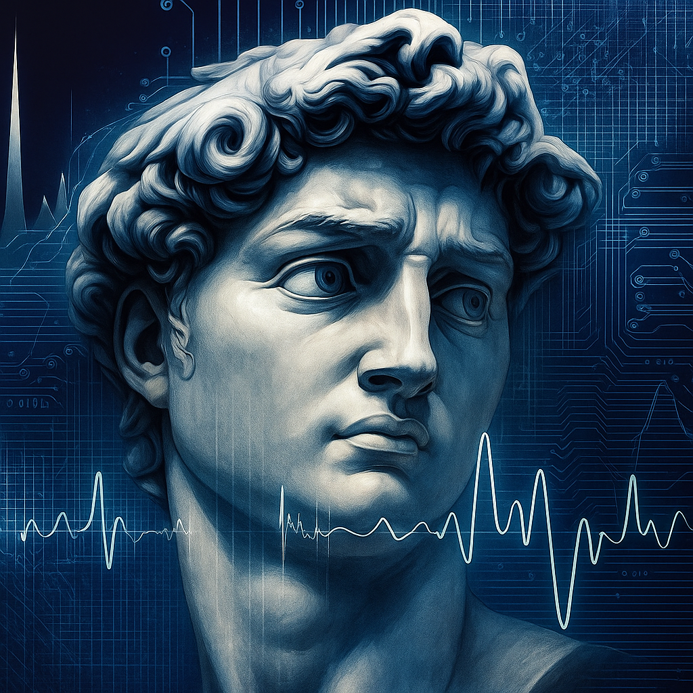

# Omelette au Fromage: Podcast de Idiomas e a Revolução da IA

Nos últimos meses, impulsionado por uma viagem, mergulhei no desenvolvimento de um [podcast](https://ltmleo.github.io/omeletteaufromage/). A ideia era aprender algumas frases em outros idiomas para me virar em algumas situações na viagem. E no melhor estilo "[Arriscando a Própria Pele](/blog/learning/livros/arriscando-a-propria-pele)", esperei fazer a viagem para testar se o podcast realmente ajudaria (realmente ajudou, precisei recorrer ao inglês apenas em situações mais complexas). Por isso, gostaria de compartilhar essa experiência e discutir um pouco sobre Inteligência Artificial (sim, usei IA em quase toda etapa do desenvolvimento, inclusive para me ajudar com esse texto), e quem sabe, inspirar outros com necessidades semelhantes.

<!-- truncate -->

A ideia do podcast surgiu de uma lembrança divertida: um episódio do "Laboratório de Dexter", onde ele precisa aprender francês em uma noite e inventa uma máquina para isso. Devido a um bug, ele acaba aprendendo a dizer apenas "Omelette Du Fromage" (o que, na verdade, é uma maneira incorreta de dizer "Omelette Au Fromage", nome do podcast!). O Podcast consiste em 10 episódios de 5min, onde frases são repetidas em diferentes vozes e velocidades, facilitando a memorização.

O mais fascinante de todo esse processo é que o podcast foi **inteiramente desenvolvido utilizando Inteligência Artificial**. Desde a concepção até a execução, a IA foi uma ferramenta poderosa em diversas etapas. Aproveitando o *hype* em torno da IA, gostaria de compartilhar algumas impressões e reflexões sobre como essa tecnologia está transformando a maneira de resolver problemas e criar soluções inovadoras.

## O Poder Habilitador da Inteligência Artificial

É inegável o poder que a IA tem para nos capacitar a fazer coisas que, antes, levaríamos anos para aprender e aperfeiçoar. Agora, conseguimos em minutos. Com o auxílio da IA no podcast, pude:

* **Gerar o script base:** A IA me ajudou a criar os diálogos e frases essenciais para cada episódio.
* **Construir o construtor do podcast:** Uma ferramenta que automatizou a organização e a estrutura dos áudios.
* **Criar as falas em diferentes idiomas, velocidades e sotaques:** Isso foi crucial para a eficácia do aprendizado, expondo o ouvinte a diversas pronúncias.
* **Até mesmo criar um site para divulgar o podcast:** Uma plataforma simples e funcional para compartilhar meu trabalho com o mundo. [Acesse aqui!](https://ltmleo.github.io/omeletteaufromage/)

:::note
Poderia ter utilizado a IA para gerar todo o conteúdo do podcast de uma vez, mas optei por manter um toque humano, escrevendo os scripts e organizando o conteúdo de forma que pudesse ter mais controle sobre as etapas e evitasse cargas de trabalho desnecessárias. Exploro um pouco mais da motivação disso e o conceito de camadas de automação na seção [Projetos](/blog/projects/omelette-au-fromage/).
:::

Além do podcast, também criei um [site](https://ltmleo.github.io/receitas/) para compartilhar receitas de família, onde escanei os livros de receitas das minhas avós e utilizei IA para transcrever o que estava escrito, uma forma de preservar e compartilhar memórias afetivas. A IA não é apenas uma ferramenta, mas um parceiro criativo que nos permite explorar novas possibilidades e resolver problemas de maneiras inovadoras. Falo um pouco mais sobre isso em [Receitas](/blog/projects/receitas/).

Esses são apenas pequenos exemplos de como a Inteligência Artificial está democratizando a inovação. Problemas que antes exigiam um investimento de tempo e dinheiro que inviabilizavam soluções, agora podem ser resolvidos de uma forma muito mais rápida e simples. Essa facilidade nos permite criar soluções customizáveis e produtos focados em nichos específicos, algo que antes era economicamente inviável.

Por isso, não é difícil de acreditar que teremos uma explosão de startups, e produtos dedicados a resolver dores de públicos e mercados que, até então, estavam desassistidos. Com a IA, testar diferentes soluções e produtos se torna muito mais barato, como aconteceu nesses exemplos, que  consegui atender a uma necessidade pessoal. Veremos uma proliferação de novos produtos e uma enxurrada de soluções, impulsionadas pela facilidade de lançar e aprimorar ideias.

## Os Desafios e Preocupações da Era da IA

No entanto, essa facilidade também traz algumas preocupações importantes. Com a capacidade de criar soluções, textos, vídeos e códigos em massa, veremos um aumento significativo do conteúdo gerado puramente por IA, criando o que alguns já chamam de `internet morta`. Nela, a maior parte das interações seria feita por IAs e não mais por humanos, mudando completamente a internet como a conhecemos, transformando-a em um ecossistema dominado por algoritmos e informações sintéticas.

Além disso, com a proliferação de novas soluções, produtos e camadas tecnológicas, a `complexidade tecnológica` também aumenta de maneira exponencial. É como se cada nova ferramenta resolvesse um problema, mas adicionasse uma nova camada de interdependência e manutenção. Isso pode levar a um ciclo vicioso, onde cada nova solução requer mais soluções para gerenciar sua complexidade, criando um labirinto de tecnologias que podem se tornar difíceis de navegar e manter.

Principalmente em ambientes corporativos, precisamos ter muito cuidado, pois em muitos casos será mais fácil criar algo do zero do que procurar, entender e evoluir algo já existente. Essa realidade, embora contraintuitiva, reflete a complexidade e a falta de padronização que muitas vezes assolam projetos legados. A ausência de documentação clara, a dependência de tecnologias obsoletas e a dificuldade em integrar novas funcionalidades podem transformar a manutenção de um sistema em um verdadeiro pesadelo, consumindo tempo e recursos valiosos que poderiam ser direcionados para inovações.

O uso da IA, por toda a sua potência, muitas vezes também esbarra no `Paradoxo de Menon de Platão`. Esse antigo enigma filosófico questiona: "Como podemos buscar algo se não sabemos o que é? E como podemos reconhecê-lo se o encontramos?". No contexto da IA, essa questão é profundamente relevante. Por mais avançados que sejam os modelos, eles operam com base nos dados e padrões que lhes são fornecidos.

Isso significa que, para guiar a IA na geração de resultados verdadeiramente inovadores ou "corretos", é necessário um entendimento claro do que se está buscando. Sem essa clareza, a IA pode produzir resultados que, embora tecnicamente corretos, não atendem às necessidades reais ou não são reconhecíveis como soluções válidas.

Além dessas, existem muitas outras complicações, e pretendo explorar mais sobre isso em um próximo artigo, onde discutirei como a IA pode ser utilizada de forma mais eficaz, evitando armadilhas comuns e maximizando seu potencial.

### O Profissional do Futuro e a Essência da Criação

Diante de todas essas transformações, qual será o papel do profissional do futuro? Acredito que, mais do que nunca, será aquele que souber orquestrar a IA, utilizá-la como uma ferramenta para expandir suas capacidades, e não se limitar a ela. Será o profissional que entenderá os princípios fundamentais, que terá a capacidade de questionar e de adicionar um toque humano único à criação.

Esse profissional precisará ir além da superficialidade, entendendo os problemas a fundo, suas nuances e o impacto das soluções. Essa habilidade de mergulhar na essência dos desafios não se aplica somente ao desenvolvimento de software, mas a qualquer área onde a IA esteja sendo utilizada. Afinal, a IA pode processar dados e gerar resultados, mas é o ser humano que define o que é problema, o que é solução e como essa solução se alinha com os valores e objetivos reais.

Nesse contexto, a ideia do programador artesão surge como uma filosofia para o desenvolvimento de software, defendendo que a criação de código deve ser encarada com a mesma paixão, cuidado e busca pela excelência que um artesão dedica à sua obra. Longe de ser apenas uma fábrica de linhas de código, o programador artesão valoriza a qualidade intrínseca do software, a manutenibilidade, a elegância e a sustentabilidade a longo prazo.

Essa abordagem enfatiza a disciplina, o aprendizado contínuo e a responsabilidade pessoal sobre o código produzido. O artesão busca aprimorar suas habilidades constantemente, dominar novas ferramentas e técnicas, e, acima de tudo, entender profundamente o problema que está resolvendo. Isso significa priorizar práticas como o desenvolvimento guiado por testes (TDD), a integração contínua, o refactoring e a colaboração em equipe, visando construir sistemas robustos, flexíveis e que realmente atendam às necessidades dos usuários. Não se trata apenas de entregar algo que "funciona", mas de entregar algo que é bem construído, confiável e que pode evoluir. É aqui que a profundidade do entendimento humano se une à capacidade de geração da IA.

Desenvolver soluções passa a ser mais ou menos como Michelangelo disse ao ser perguntado como esculpia suas verdadeiras obras-primas: "Vi um anjo no bloco de mármore e simplesmente fui esculpindo até libertá-lo." e "Como faço uma escultura? Simplesmente retiro do bloco de mármore tudo que não é necessário". Essas frases desse verdadeiro gênio são mais do que nunca verdadeiras em nossa era. A IA pode ser vista como o bloco de mármore, vasto e cheio de potencial, e nós, os artesãos, devemos enxergar as soluções e inovações que estão escondidas dentro dela. Nosso papel é, como Michelangelo, esculpir o bloco de mármore que a IA nos apresenta, encontrando a solução para os problemas e retirando tudo que não é necessário, até que a verdadeira obra-prima se revele.

## Conclusão

A revolução da Inteligência Artificial está apenas começando, e o podcast "Omelette au Fromage" é um pequeno exemplo de como podemos utilizar essa tecnologia para resolver problemas de maneira inovadora e acessível. A IA não é apenas uma ferramenta, mas um parceiro criativo que nos permite explorar novas possibilidades e criar soluções que antes pareciam impossíveis. No entanto, é fundamental que continuemos a questionar, a entender profundamente os problemas e a manter um toque humano em nossas criações. O futuro pertence àqueles que souberem orquestrar a IA, utilizando-a como uma extensão de suas capacidades, e não como um substituto. Pretendo continuar explorando essas ideias e desafios em futuros artigos, e espero que essa reflexão inspire outros a abraçar a revolução da IA de maneira consciente e criativa.

O que vocês acharam da ideia do podcast? Já pensaram em utilizar a IA para resolver problemas pessoais ou profissionais? Estou curioso para saber como vocês estão utilizando essa tecnologia em suas vidas e trabalhos. O que vocês acham que o futuro reserva para a Inteligência Artificial e o papel do profissional nesse cenário? Deixem seus comentários e vamos continuar essa conversa!

## Referências

1. https://www.ufsm.br/pet/sistemas-de-informacao/2025/03/07/a-teoria-da-internet-morta-estamos-cercados-por-bots
2. https://www.gartner.com/doc/reprints?id=1-2IPGQWUX&ct=240903&st=sb&?ocid=eml_pg454105_gdc_comm_gh&mkt_tok=MTU3LUdRRS0zODIAAAGbF5ftjk5f2YHKk8Ork8DYbxImJKMqoPAhEMh5POMjFjpns4Y0jA9dzspZV5fLw4kgPu9hDhFARmbkIXf5LTAcWt7bXXrkHkoCkOoEwtRuiNWRIIn1hpqCdrfi
3. https://www.thoughtworks.com/pt-br/insights/blog/implications-tech-stack-complexity-executives
4. The Software Craftsman: Professionalism, Pragmatism, Pride - Sandro Mancuso 

