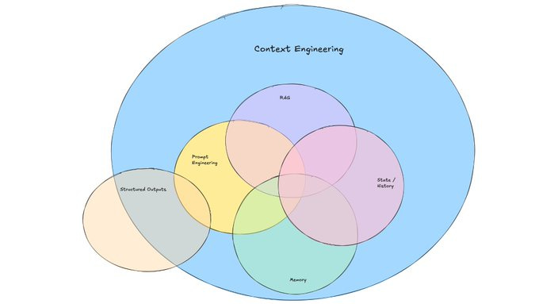

# FullCycle - IA Na Pratica

## IA como ferramenta

IA nos da ferramentas que nos ajudam no processo continuo

- Analise de problemas
- Tomada de decisões
- DocumentaçÕes
- Codificações

## IA como projeto de software a ser desenvolvido

- Aplicações tradicionais vao usar IA
- Agentes de IA
- Protocolos de comunicação

## Arquitetura de software e de solução

- Integrar aplicações usando IA
- Agentes de IA
- Protocolos de comunicação
- Design Patterns
- 12 Factors de Agents
- Design Docs
- Analise de modelos e tradeoffs
- Segurança:
  - Jailbreaks: Fazer a IA se comportar de forma diferente do esperado
  - Prompt Injection: Injetar comandos maliciosos na IA
  - Data Poisoning: Corromper os dados de treinamento da IA
  - Guardrails: Proteções para evitar comportamentos indesejados
  - Privacidade: Proteger dados sensíveis
  - BIAS: Evitar preconceitos e discriminação
- Evaluation: Testar e validar a IA
- Contex engineering: Ajustar a IA para o contexto específico
- Escalabilidade: Garantir que a IA funcione em larga escala
- Pipelens, messageria, custo e Qualidade
- Cloud (Vertex AI, sagemaker, etc)
- Banco de dados -> Vetoriais

## Context Engineering

- **Uso de ferramentas**: Garantir que se um agente precisar acessar informações externas, ele tenha as ferramentas necessárias para isso. Quando as ferramentas retornam informação, elas são formatadas de uma forma que seja facilmente compreendida pelo agente.
- **Memoria de curto prazo**: Quando uma conversa dura um certo tempo, criar um resumo da conversa e usa-lo no futuro.
- **Memoria de longo prazo**: Se um usuário expressou preferencias em uma conversa anterior, se capaz de recuperar essas informações em conversas futuras.
- **Engenharia de prompts**: As instruções sobre como um agente deve se comportar são claramente definidas no prompt.
- **Recuperação**: Buscar infamações de forma dinâmica e inseri-las no prompt antes de acionar o LLM.

## Referências

- https://www.youtube.com/watch?v=6E5jpNC1iR0
- https://github.com/coleam00/context-engineering-intro