# LLM

- LLM: Large Language Model (Cloude, OpenAI, Gemini, Llama, Mistral, etc.)
- SML: Small Language Model

- **Modelo**: Representação da realidade
- **Linguagem**: Objeto do modelo é a linguagem
- **Large**: Bilhões de parâmetros (pesos e vieses)
- **Generativo**: Capacidade de gerar novos dados.

## GPT

- GPT: Generative Pre-trained Transformer

- **Modelo Unigrama**: Não considera o contexto, apenas a frequência das palavras. O que voce escreve não impacta na probabilidade da próxima palavra.

- **Modelo Bi-grama**: Considera a palavra anterior para prever a próxima palavra. O que voce escreve impacta na probabilidade da próxima palavra.

- **Modelo N-grama**: Considera as N palavras anteriores para prever a próxima palavra. O que voce escreve impacta na probabilidade da próxima palavra. (Os LLMs são modelos N-grama com N muito grande, o que permite considerar um contexto maior).

- **Token**: Unidade básica de texto que o modelo processa. Pode ser uma palavra, parte de uma palavra ou até mesmo um caractere, dependendo do modelo.

- **Embedding**: Representação numérica de palavras ou frases em um espaço vetorial, permitindo que o modelo compreenda relações semânticas entre elas.

- **Stemming**: Processo de reduzir palavras às suas raízes ou formas básicas, removendo sufixos e prefixos. (lematização)

Todo modelo de linguagem tem Tokens e Stemming por trás.


## Formula de Bayes

Probabildidade = Chance de um evento ocorrer

```plaintext
P(A) = # Ocorrências de A / # Total de Eventos (espaço amostral)
```

- P(A,B) -> Probabilidade conjunta de A e B ocorrerem juntos (A e B)
- P(A|B) -> Probabilidade condicional de A ocorrer dado que B ocorreu (A dado B)

```plaintext
P(A,B) = P(A|B) * P(B) -> # A e B ocorrem / # Total de eventos

P(A|B) = P(A,B) / P(B) -> # A e B ocorrem / # onde B ocorre

P(A|B) = P(B|A) / P(B) * P(A) -> # A e B ocorrem / # onde B ocorre

P(B|A) / P(B) -> Permite atualizar o conhecimento da nova informação. É o aprendizado (learning) do modelo.
```

### Aplicações

- Pela refelexão de um espectro eletromagnético, podemos inferir a probabilidade de um peixe ser salmão ou atum.
- Pela análise de um texto, podemos inferir a probabilidade de um email ser spam ou não spam.
- Pela análise de sintomas, podemos inferir a probabilidade de um paciente ter uma doença específica

Para plotar gráficos: https://desmos.com/calculator

### O Modelo de Naive Bayes

O modelo de Naive Bayes é um classificador probabilístico baseado no Teorema de Bayes, que assume a independência entre as características (features) do conjunto de dados. Apesar dessa suposição simplista, o modelo é eficaz em várias aplicações práticas, como filtragem de spam, análise de sentimentos e reconhecimento de texto. 

- É um modelo de classificação.

- **Independência de variáveis**: Uma variável não influencia a outra. Exemplo: A cor do carro não influencia o modelo do carro. `P(A,B) = P(A) * P(B)`. Se A e B são independentes, a probabilidade de A dado B é igual a probabilidade de A. `P(A|B) = P(A)`.

- Modelos servem para simplificar a realidade.
- O modelo de Naive Bayes supõe que as variáveis wi possuem uma independência condicional, ou seja, a probabilidade de wi dado a classe c é independente das outras variáveis. `P(wi|c, wj) = P(wi|c)`.
- O Naive Bayes permite calcular e estimar eventos que não foram observados no conjunto de dados de treinamento.


#### Detector de SPAM

1. Carrega csv (messagens classificadas como spam ou ham)
2. Tokeniza as frases (separa em tokens)
3. Para melhorar a performance, aplica Stemming (reduz as palavras às suas raízes)
4. Calcula o logaritmo da probabilidade de cada frase ser spam ou ham.
5. Classifica novas mensagens com base nas probabilidades calculadas.

## Classificação e Regressão

- **Aprendizado Supervisionado**: PrevisÕes -> dados -> categorizados (labeled). Dado um conjunto de dados com entradas e saídas conhecidas, o modelo aprende a mapear as entradas para as saídas corretas. Exemplo: Classificação de emails como spam ou não spam, reconhecimento de imagens, etc. Nosso cerebro funciona diferente (fewshot learning e reinforcement learning).

- **Classificação**: Categorias discretas (spam ou não spam, gato ou cachorro, etc.) Ex. Classificação logística, SVM, Decision Trees, Random Forest, etc.
- **Regressão**: Valores contínuos (preço de uma casa, temperatura, etc.)Ex. Regressão linear, regressão polinomial, etc.

## O que é o Gen de GenAI?

GenAI refere-se a uma classe de modelos de inteligência artificial projetados para gerar texto, imagens ou outros tipos de conteúdo de forma autônoma. Esses modelos são treinados em grandes conjuntos de dados e utilizam técnicas avançadas de aprendizado de máquina para criar conteúdo novo e original com base em padrões aprendidos durante o treinamento.

- **Modelo Discriminativo**: Classifica ou rotula os dados de entrada. Exemplo: Classificação de emails como spam ou não spam.
- **Modelo Generativo**: Gera novos dados semelhantes aos dados de treinamento. Exemplo: Geração de texto, imagens, etc.

- **Deep Learning**: Subcampo do aprendizado de máquina que utiliza redes neurais profundas para modelar e resolver problemas complexos. Exemplo: Redes neurais convolucionais (CNNs) para reconhecimento de imagens, redes neurais recorrentes (RNNs) para processamento de linguagem natural, etc.
- **GAN**: Generative Adversarial Network. Consiste em duas redes neurais que competem entre si: uma geradora (generator) que cria novos dados e uma discriminadora (discriminator) que avalia a autenticidade dos dados gerados. O objetivo é melhorar a qualidade dos dados gerados ao longo do tempo.
- **VAE**: Variational Autoencoder. É um tipo de rede neural que aprende a codificar dados de entrada em um espaço latente e, em seguida, decodifica esse espaço latente para gerar novos dados semelhantes aos dados de entrada originais.

## RAG (Retrieval-Augmented Generation)

RAG é uma técnica que combina modelos de linguagem generativos com sistemas de recuperação de informações para melhorar a precisão e relevância das respostas geradas. Em vez de depender exclusivamente do conhecimento pré-treinado do modelo, o RAG utiliza uma base de dados externa para buscar informações relevantes em tempo real, que são então incorporadas na geração da resposta.

O RAG é uma estratégia de contexto: Outra estratégia é o fine-tuning, porém é mais custoso e demorado.

RAG: Pergunta -> Busca a informação relevante (Information Retrieval) -> Faz o prompt mais o contexto encontrado -> LLM Usa o contexto para gerar a resposta.

- **Bag of Words (BoW)**: Representação de texto onde a ordem das palavras é ignorada e apenas a frequência de cada palavra é considerada. Cada documento é representado como um vetor de contagem de palavras.
- **Lematização**: Processo de reduzir palavras às suas formas básicas ou dicionário, considerando o contexto. Exemplo: "correndo", "correu" e "correr" são reduzidos a "correr".

N Documentos -> N Bags of Words -> N Vetores

- **TF**: Term Frequency. Mede a frequência de uma palavra em um documento. 
- **IDF**: Inverse Document Frequency. Mede a importância de uma palavra em todo o conjunto de documentos. Palavra aparece muito em um documento, mas pouco em outros documentos, é uma palavra importante.

Um bom information retrieval é de suma importância para o RAG.

Problema que RAG visa resolver: Encontrar a informação correta em um grande volume de dados e gerar uma resposta precisa e relevante. Qual informação melhor se adequa a query realizada?

## Embeddings

### Alebra Linear

- **Vetores**: Representação numérica de palavras ou frases em um espaço vetorial, permitindo que o modelo compreenda relações semânticas entre elas.
- **Modulo**: Comprimento do vetor.
- **Produto Escalar**: Mede a similaridade entre dois vetores. Quanto maior o produto escalar, mais semelhantes são os vetores.
- **Cosseno**: Mede o ângulo entre dois vetores. Quanto menor o ângulo, mais semelhantes são os vetores.
- **Distância Euclidiana**: Mede a distância entre dois vetores. Quanto menor a distância, mais semelhantes são os vetores.
- **Matriz**: Conjunto de vetores organizados em linhas e colunas.
- **Transformação Linear**: Operação que transforma um vetor em outro vetor, preservando a estrutura linear. Exemplo: Rotação, translação, escala, etc.
- **Autovalores e Autovetores**: Propriedades de uma matriz que descrevem como a matriz transforma os vetores. Autovetores são vetores que não mudam de direção após a transformação, apenas seu comprimento é alterado pelo autovalor correspondente.

### One-Hot Vectors

- Representação binária onde cada palavra é representada por um vetor com um único elemento "1" (indicando a presença da palavra) e todos os outros elementos "0". Exemplo: Para um vocabulário de 5 palavras, a palavra "gato" pode ser representada como [0, 1, 0, 0, 0] para a frase "o gato está no telhado".

- Cada palavra é uma direção diferente em um espaço de alta dimensão (ortogonais entre si).
- No One-Hot Vectors **Todas palavras são ortogonais**.

- A distancia de todas as palavras é a mesma (sqrt(2)). Por isso, todo conteúdo semântico é perdido.
- Não captura relações semânticas entre palavras.
- Cada palavra é uma dimensão diferente. Então em textos longos, o espaço vetorial fica muito grande (curse of dimensionality) e se torna inviável.

Como capturar relações semânticas entre palavras?

- Queremos que palavras semelhantes estejam próximas no espaço vetorial (theta ~ 0).
- Queremos que palavras diferentes estejam distantes no espaço vetorial (theta ~ 90 graus).
  
### Word2Vec

- Técnica de aprendizado de máquina que transforma palavras em vetores densos, capturando relações semânticas entre elas.
- Utiliza redes neurais para aprender representações vetoriais de palavras com base em seu contexto.
- Palavras semelhantes aparecem em contextos semelhantes, então seus vetores devem estar próximos no espaço vetorial.
- Dois modelos principais: Continuous Bag of Words (CBOW) e Skip-Gram.
- Skip-Gram: `O garoto jogou bola` -> Fixa a palavra garoto e olha as palavras no contexto (O, jogou, bola) para prever o vetor da palavra garoto.
- CBOW: `O garoto jogou bola` -> Fixa as palavras no contexto (O, jogou, bola) para prever o vetor da palavra garoto.
- Pega um espaço de altissima dimensão (todas as palavras do vocabulário) e reduz para um espaço de baixa dimensão (100, 200, 300 dimensões).

Site com explicação visual: 
- https://jalammar.github.io/illustrated-word2vec/
- https://projector.tensorflow.org/

Operações com vetores:
```python
model.most_similar(positive=['king', 'woman'], negative=['man'])
# Resultado: queen
# rei - homem + mulher = rainha
```

### Sistema de memória

```python

from langgraph.checkpoint.memory import MemorySaver
from langgraph.graph import START, MessagesState, StateGraph

workflow = StateGraph(state_schema = MessagesState)

def call_mode(state: MessagesState):
  response = llm.invoke(state["messages"])
  return {"messages": response}

workflow.add_edge(START, "model")
workflow.add_node("model", call_mode)
memory = MemorySaver()
app = workflow.compile(memory)

query = "Oi! Meu nome é Leo"
config = {"configurable": {"thread_id": "abc123"}}
inpute_messages = [HumanMessage(query)]
output = app.invoke({"messages": inpute_messages}, config)
output["messages"][-1].pretty_print()
# E aí, Leo! Prazer em te conhecer. Em que posso te ajudar hoje? 😊
query = "Qual o meu nome?"
output = app.invoke({"messages": inpute_messages}, config)
output["messages"][-1].pretty_print()
# Seu nome é Leo! Você acabou de me dizer. 😉
config = {"configurable": {"thread_id": "xyz789"}}
output = app.invoke({"messages": inpute_messages}, config)
output["messages"][-1].pretty_print()
# Eu sou um modelo de linguagem grande, treinado pelo Google. Eu não tenho nome.
``` 

## Fluxograma RAG

```mermaid
flowchart LR
    A[Pergunta] --> B[Banco de Dados]
    B --> C[Pedaços Relevantes]
    C --> D[Pergunta + Contexto + prompt]
    A --> D
    D --> E[LLM]
    E --> F[Resposta]
```



No fundo é um sistema de busca (search engine) + LLM.

- **Naive Rag:** Usa TF-IDF + Bag of Words (BoW) para buscar os pedaços relevantes no banco de dados.
- **Advanced Rag**: Usa Embeddings + Similaridade de Cosseno para buscar os pedaços relevantes no banco de dados.
- **Graph RAG**: Usa Grafos para buscar os pedaços relevantes no banco de dados.

## Structured Outputs

Formatação estruturada da resposta do modelo. Muito útil para extrair informações específicas e garantir que a resposta esteja em um formato consistente.

- **Pydantic**: Biblioteca de validação de dados e configuração baseada em tipos para Python. Utilizada para definir e validar estruturas de dados complexas, garantindo que os dados atendam a requisitos específicos.

```python
from pydantic import BaseModel, Field
from langchain_google_genai import ChatGoogleGenerativeAI
from google.colab import userdata
import os
import google.generativeai as genai
class Piada(BaseModel):
  setup: str = Field(description="A introdução da piada")
  punchline: str = Field(description="A parte engraçada da piada")
  rating: int = Field("Avaliação de 1 a 10 da piada")

structured_llm = llm.with_structured_output(Piada)

repose = structured_llm.invoke("Me conte uma piada sobre gatos.")
print(repose.model_dump_json(indent=2))
# {
#   "setup": "Por que os gatos são tão ruins no pôquer?",
#   "punchline": "Porque sempre tem um ás na manga!",
#   "rating": 5
# }
```

## Tools

- As Tools não são chamadas pela LLM.
- Antigamente faziam técnicas de prompts para a LLM construir o payload da API.
- MCP: Model-Centric Programming
- LLMS conseguem se comunicar com buscas, calculadoras, etc.
- A LLM não chama a Tool, quem chama a Tool é o programa.

```python
from langchain.tools import tool

@tool
def multiplique(a: float, b: float):
  """multipla dois numeros reais"""""
  print(f"Multiplicando {a} por {b}")
  return a * b

llm_with_tools = llm.bind_tools(multiplique)
result = llm_with_tools.invoke("Multiplique 1 por 2")
print(result)

tool_call = result.tool_calls[0]
tool_name = tool_call['name']
tool_args = tool_call['args']
print(tool_name)
print(tool_args)

if tool_name == multiplique.name:
    result = multiplique.invoke(tool_args)
    print(result)
```

## Agents

- Agent: Agente que pode tomar decisões e executar ações com base em entradas e saídas.


- tool: Tem que ter a capacidade de interagir com diversas ferramentas terceiras.
- memoria: Armazenar e recuperar informação - aprende com experiências passadas.
- planejamento: Estruturar e analisar o problema e quebrando em n passos.

- LLM Ganhar a capacidade de `planning` e `reasoning` (raciocínio).

## Estudo de caso


- https://dropbox.tech/machine-learning/building-dash-rag-multi-step-ai-agents-business-users
- https://builders.ramp.com/post/industry_classification
- https://building.nubank.com/pt-br/solucao-de-ia-para-busca/
- https://www.shopify.com/blog/ai-models