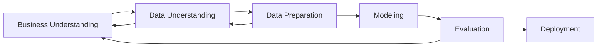

# Árvores, Redes e Ensemble Models

## CRISP-DM

```mermaid
graph LR
    A[Business Understanding] --> B[Data Understanding]
    B --> A
    B --> C[Data Preparation]
    C --> B
    C --> D[Modeling]
    D --> E[Evaluation]
    E --> A
    E --> F[Deployment]
```

## Para saber mais

- https://jakevdp.github.io/PythonDataScienceHandbook/05.01-what-is-machine-learning.html
- 