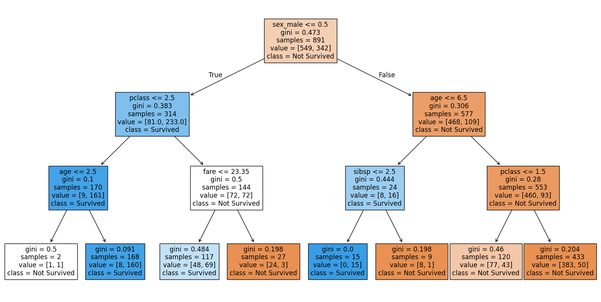
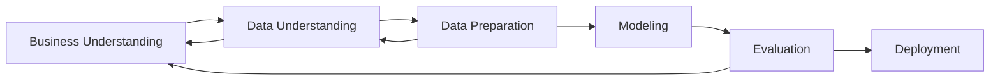

# Árvores, Redes e Ensemble Models



## CRISP-DM



Algorítimos famosos: CART, ID3, C4.5, C5.0, CHAID, MARS, etc.

## Arvores de Decisão

Uma arvore de decisão é uma estrutura de dados (Grafo) que divide um conjunto de dados em subconjuntos menores. Cada divisão é feita com base em um valor de um atributo. O processo é repetido até que todos os subconjuntos sejam homogêneos.

A primeira pergunta é chamada de quebra ou split. O objetivo é dividir o conjunto de dados em subconjuntos menores. O processo é repetido até que todos os subconjuntos sejam homogêneos.

As próximas perguntas são chamadas de nós. 

As folhas são os nós finais da árvore.

Profundidade da árvore é o número de perguntas que podem ser feitas.

A entropia é uma medida de incerteza. Quanto maior a entropia, maior a incerteza.

Arvores são robustas, interpretáveis e flexíveis. Sem suposições probabilísticas. Necessário cross validation.

## Algoritimos para construção de árvores

O Modelo busca uma separação perfeita das observações que classificamos como eventos e não evento, cam base em variáveis observáveis como ideias, idade, sexo, etc.

1. O algorítimos testa todas as possíveis quebrar binarias que podem fazer com as variáveis disponíveis e escolhe a melhor minimizando a entropia (indicador de impureza).
2. Depois de escolher a melhor quebra, o algorítimo repete o processo para cada subgrupo. 
3. O processo é repetido até que a regra de parada seja atingida.

## Entropia

A entropia é uma medida de incerteza. Quanto maior a entropia, maior a incerteza.

- Impureza máxima com distribuição uniforme
- Impureza mínima com concentração total

## Gini e ROC

A curva ROC é uma curva que mostra a taxa de verdadeiros positivos em função da taxa de falsos positivos. A área sob a curva é chamada de AUC.

GiNI é uma medida de impureza.

```python
GINI = (AUC-0.5)*2
```

Uma boa variável é aquela que possui um índice Gini menor.

## hiperparâmetros

São parâmetros que controlam o algorítimo como:

1. Numero mínimos de observações por folha
2. Profundidade máxima da árvore
3. CP - Custo de complexidade

## Overfitting e Underfitting

- **Overfitting**: A árvore é muito complexa e se ajusta muito bem aos dados de treinamento, mas não generaliza bem para novos dados.
- **Underfitting**: A árvore é muito simples e não consegue capturar a complexidade dos dados.


## Cross Validation

É uma técnica para avaliar a capacidade de generalização de um modelo. O conjunto de dados é dividido em algumas partes. O modelo é treinado nas partes e testado na parte restante.

:::warning
Escolher parametros do modelos com uma base de validação ainda pode propiciar overfitting.
:::

- Amostra de treinamento: Usada para treinar o modelo.
- Amostra de validação: Usada para ajustar os hiperparâmetros.
- Amostra de teste: Usada para avaliar o modelo.

### K-Fold Cross Validation

- Divide o conjunto de dados em k partes.
- O modelo é treinado em k-1 partes e testado na parte restante.
- O processo é repetido k vezes.
- A métrica de avaliação é a média das métricas de avaliação de cada fold.
 

## Arvore como um classificador

Podemos ter a estimativa de probabilidade de um evento ocorrer.

## Avaliação de um modelo

- **Matriz de confusão**: Mostra a relação entre as previsões e os valores reais. Para cada ponto de corte, temos uma matriz de confusão.
- **Precisão**: Proporção de previsões corretas.
- **Acurácia**: Acerto sobre tentativas.
- **Sentitividade**:TRUE POSITIVES / (TRUE POSITIVES + FALSE NEGATIVES)
- **Especificidade**: TRUE NEGATIVES / (TRUE NEGATIVES + FALSE POSITIVES)

## Para saber mais

- https://jakevdp.github.io/PythonDataScienceHandbook/05.01-what-is-machine-learning.html
- https://stackoverflow.com/questions/9979461/different-decision-tree-algorithms-with-comparison-of-complexity-or-performance
