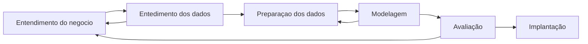

# Deployment de modelos

## Revisando o processo de minireção de dados

Enquanto não implantamos o modelo, podemos fazer tunning do modelo, reavaliar os dados, etc. 

## Ciclo de vida de modelos
- Coleta e preparação de dados
- Treinamento e validação
- Deploy
- Monitoramento contínuo
- Atualização e re-treinamento
- Depreciação de modelos desatualizados

## Desafios nos deployments de modelos
- Data drift
- Diferença entre dev e prod
- Monitoramento de performance
- Gereneciamento de versões
- Implementação e funcionamento do MLOps

## MLOPS - Machine Learning Operations
Combina práticas de DevOps com Machine Learning para melhorar a qualidade e a velocidade de entrega de modelos de Machine Learning.

Automatiza o ciclo de vida de modelos de Machine Learning, incluindo treinamento, avaliação, deploy e monitoramento. Utiliza ferramentas e práticas de DevOps para facilitar a dinâmica entre cientistas de dados, engenheiros de software e operações de TI.

## Ferramentas de MLOps
- Kubeflow
- MLflow
- Weight & Biases
- Neptune.ai
- Seldon
- Polyaxon

### MLflow

- Mlflow Tracking: Gerencia experimentos, resultados e métricas
- Mlflow Projects: Empacota e executa código em diferentes ambientes
- Mlflow Models: Empacota modelos em formato padrão para deploy
- Mlflow Registry: Armazena, gerencia e controla versões de modelos

#### Benefícios do MLflow
- Rastreabilidade e controle de versão
- Integração com multiplos frameworks e linguagens
- Simplificação de deploy e monitoramento
- Facilita o retreiamento e atualização de modelos

#### Arquitetura do MLflow

Deploy de modelos

##
**Parei em 3:00**
##

## Para saber mais

- https://mlflow.org/docs/latest/introduction/index.html
- 

