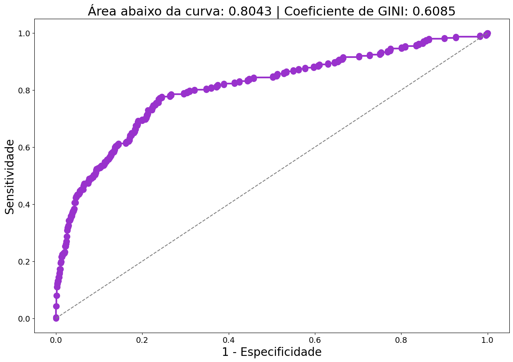
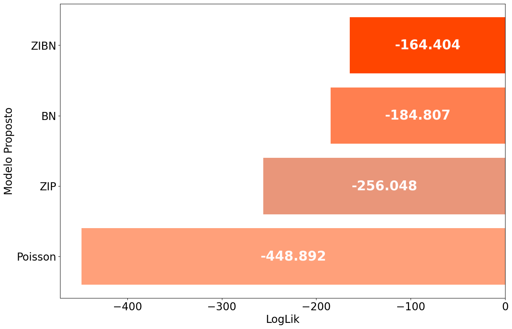

# Exercícios de Machine Learning Supervisionado

Identificar a variável dependente:

Variável dependente é a variável que queremos prever, ou seja, a variável que queremos explicar. Ela é representada por Y.

1. Variável dependente métrica (aderência dos resíduos a normalidade): Modelos de regressão simples e múltipla MQO;
2. Variável dependente qualitativa: Modelos de regressão logística binaria e multinomial;
3. Variável dependente com valores métricos, discretos e não negativos, para dada exposição (contagem): Modelos de regressão para dados de contagem;

> *MQO: Mínimos quadrados ordinários*

Avaliar 3 pressupostos:

1. Aderência dos resíduos a normalidade;
2. Multicolinearidade;
3. Heterocedasticidade (indicio de variáveis omitidas).;

Desejamos, que os resíduos estejam aderentes a função normal, ausência de multicolinearidade e ausência de Heterocedasticidade. Sendo necessário, podemos aplicar a transformação de Box-Cox na variável dependente para normalizar os resíduos e corrigir algum aspecto do modelos.

## Avaliando multicolinearidade

Multiplicação de variáveis independentes, que são correlacionadas, podem causar problemas de multicolinearidade.

Analise do coeficiente de correlação de Pearson entre as variáveis (Matriz de correlação de Pearson);

Se tem variáveis categóricas precisa passar pelo processo de dummizacão.

## Avalidando adereência dos resíduos a normalidade

Utilizamos o teste de Shapiro-Francia para avaliar a aderência dos resíduos a normalidade. Se o p-value for menor que a significância, aceitamos a hipótese nula de que os resíduos são normalmente distribuídos.

```python
from statstests.tests import shapiro_francia
teste_sf = shapiro_francia(reg.resid)
alpha = 0.05 # nível de significância do teste
if teste_sf['p-value'] > alpha:
  print('Não se rejeita H0 - Distribuição aderente à normalidade')
else:
  print('Rejeita-se H0 - Distribuição não aderente à normalidade')
```

Para fazer a variável dependente se adequar a normalidade, podemos aplicar a transformação de Box-Cox.

```plaintext
Y_boxcox = (Y_i^λ - 1) / λ
```

Olhar o p-value de cada variável, se for maior que a significância, precisamos remover essas variares (não possuem significância estatística), para isso podemos utilizar o método stepwise. O método stepwise é um método de seleção de variáveis que seleciona as variáveis que mais contribuem para o modelo, entregando o melhor modelo possível.

Pode acontecer qu mesmo depois de aplicar a transformação de Box-Cox, os resíduos não se adequarem a normalidade. Nesse caso, podemos melhorar a base de dados (maior numero de amostras, mais variáveis preditoras relevantes e etc) ou utilizar outros tipos de modelagem (arvores de decisão, redes neurais, etc).

## Avaliando Heterocedasticidade

Para avaliar a heterocedasticidade, podemos utilizar o teste de Breusch-Pagan. Se o p-value for menor que a significância, aceitamos a hipótese nula de que os resíduos são homocedásticos.

Heterocedasticidade é a variância dos resíduos que não é constante. Fazendo com que os resíduos sejam mais dispersos em uma parte do gráfico e menos dispersos em outra parte (formato de cone).

A transformação de Box-Cox também pode ser utilizada para corrigir a heterocedasticidade.

Com a transformação de Box-Cox, podemos corrigir a heterocedasticidade e a aderência dos resíduos a normalidade.

## Modelos de regressão logística binaria

Modelo de regressão logística binária é utilizado quando a variável dependente é binária (0 ou 1, evento ou não evento).

O cutoff é o ponto de corte que separa as classes da variável dependente em eventos e não eventos.
Mudar um cutoff muda a sensitividade, especificidade e acurácia do modelo.

Para avaliar o modelo sem depender do cutoff, podemos utilizar a curva ROC (Receiver Operating Characteristic). A curva ROC é um gráfico que mostra a relação entre a sensitividade e a especificidade do modelo.
Para cada cutoff, temos um par de valores de sensitividade e especificidade. 



A área sob a curva ROC (AUC) é um indicador da qualidade do modelo. Quanto maior a AUC, melhor o modelo.

A métrica de avaliação de coeficiente de Gini às vezes é utilizada como uma métrica de avaliação alternativa para a AUC e as duas medidas estão estreitamente relacionadas.
O coeficiente de Gini é calculado como o dobro da área entre a curva ROC e a diagonal, ou como `Gini = 2AUC – 1`.

O odds ratios serve para avaliar a relação entre as variáveis independentes e a variável dependente. O odds ratio é a razão entre a chance de um evento ocorrer e a chance de um evento não ocorrer. Se o odds ratio for maior que 1, a variável independente aumenta a chance do evento ocorrer. Se o odds ratio for menor que 1, a variável independente diminui a chance do evento ocorrer. Podemos saber o quanto a variável independente aumenta ou diminui a chance do evento ocorrer através do odds ratio.

Calculo o predict com todos os valores constantes, exceto em uma categoria, para saber o quanto a variável independente aumenta ou diminui a chance do evento ocorrer através do odds ratio.

```plaintext
chance1 = p1 / (1 - p1)
chance2 = p2 / (1 - p2)
odds_ratio = chance1 / chance2
```

Então em média a chance de um evento ocorrer é `odds_ratio` vezes maior ao mudar a variável independente de x para y.

## Modelos para dados de contagem

Modelos para dados de contagem são utilizados quando a variável dependente é uma contagem de eventos. Acidentes por semana, número de vendas por dia, número de ligações por hora, etc.

Modelos para dados de contagem são modelos de regressão que se adéquam a distribuição de Poisson ou binominal negativa. Para saber qual devemos olhar para a superdistensão dos dados. Se a variância for maior que a média, utilizamos a distribuição binomial negativa. Se a variância for igual a média, utilizamos a distribuição de Poisson.

- **Poisson**: Média = Variância
- **Binomial Negativa**: Variância >> Média

Avaliar também se existe inflação de zeros, que é quando a variável dependente tem muitos zeros. Se a variável dependente tem muitos zeros, podemos utilizar modelos de zero inflado. Para avaliar a inflação de zeros, podemos utilizar a tabela de frequências da variável dependente, para confirmar estaticamente também podemos utilizar o teste de Vuong, que compara o modelo de Poisson com o modelo de zero inflado.

```python
vt = vuong_test(modelo_zip, modelo_poisson)
if vt.pval <= 0.05:
  print("H1: Indicates inflation of zeros at 95% confidence level")
else:
  print("H0: Indicates no inflation of zeros at 95% confidence level")
```

Parte dos zeros são estruturais devido ao componente dicotômico da variável dependente, ou seja, a probabilidade de um evento ocorrer ou não o evento.

> Separar as variáveis provenientes do componente de contagem e as variáveis provenientes do componente dicotômico.

Comparar o Log-Likelihood de cada modelo, para saber qual é o melhor modelo. Quanto maior o Log-Likelihood, melhor o modelo.



## Para saber mais

- https://www.ibm.com/docs/pt-br/spss-modeler/18.4.0?topic=node-analysis-analysis-tab
