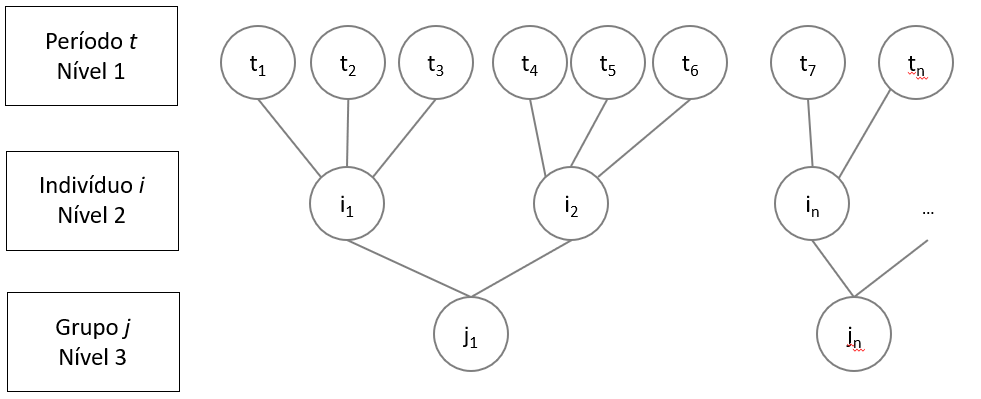

# Modelagem Multinível

## GLMM - Generalized Linear Models Multilevel

- Modelos multinível
- Modelos hierárquicos
- HLM (Hierarchical Linear Models)
- Mixed Models
- GLLAMM (Generalized Linear Latent and Mixed Models)
- Nested Models (Modelos Aninhados)
- Modelos Contextuais
- RCM (Random Coefficient Models)

## Modelos Multinível

Modelos multinível são modelos estatísticos que permitem a análise de dados hierárquicos, ou seja, dados que possuem uma estrutura de aninhamento, como por exemplo, alunos em escolas, pacientes em hospitais, funcionários em empresas, etc.


* Y = efeito fixo + efeito aleatório + erro

* Modelos multinível naturalmente consideram heterocedasticidade naturalmente. Diagnostico da heterocedasticidade (cone se abrindo) é omissão de variáveis relevantes, no caso de GLMM considera naturalmente pois considera efeitos aleatórios de inclinação e intercepto.

* `var(u_0j)`: Variância dos efeitos aleatórios de intercepto
* `var(u_ij)`: Variância dos efeitos aleatórios de inclinação

* `var(u_0j) ~= 0 e var(u_ij) ~= 0`: OLS(GLM)
* `var(u_0j) ~= 0 e var(u_ij) != 0`: Interceptos aleatórios
* `var(u_0j) != 0 e var(u_ij) ~= 0`: Inclinações aleatórias
* `var(u_0j) != 0 e var(u_ij) != 0`: Interceptos e inclinações aleatórias


* OLS é um caso especial de GLMM, onde não há efeitos aleatórios.
* Dummização permite eventos aleatórios de intercepto.

* **Box-Cox Transformation** - Transformação de Box-Cox é uma técnica que pode ser usada para estabilizar a variância e tornar os resíduos mais próximos da normalidade. As vezes nem isso é suficiente, e é necessário usar modelos multinível.

Se a variância dos termos aleatórios forem estadisticamente diferentes de zero, então o modelo multinível é mais apropriado.

* Não existe procedimento stepwise para estimação de modelagem multinível, pois a retirada de uma variável pode afetar o modelo como um todo. Utiliza-se a estratégia de step-up.

* **ICC**: Intraclass Correlation Coefficient - Mede a proporção da variância total que é devida a variação entre os grupos. `ICC = Variância entre os grupos / Variância total`. Mostra o quanto da variância é explicada pelo efeito do grupo.

### Step-Up Strategy
1. Primeiro roda-se o **modelo nulo** (modelo sem variação no x, so tem efeito aleatório de intercepto), Se a variância do efeito aleatório de intercepto nao for estaticamente aleatório, nao se justifica a modelagem multinível, é OLS.
* nível 1: `desempenho_ij = β_0j + e_ij`
* nível 2: `β_0j = γ_00 + u_0j` (γ_00 grand mean ou intercepto - componente de efeito fixo, u_0j efeito aleatório de intercepto)
* substituindo: `desempenho_ij = γ_00 + u_0j + e_ij` (se não tiver variação de u_0j, não se justifica a modelagem multinível)

2. Modelo com **intercepto e inclinação aleatórios**. 
* nível 1: `desempenho_ij = β_0j + β_1j * x_ij + e_ij` - e_ij erro indiossincrático
* nível 2: `β_0j = γ_00 + u_0j` e `β_1j = γ_10 + u_1j`  u_0j efeito aleatório de intercepto, u_0j efeito aleatório de inclinação
* substituindo: `desempenho_ij = γ_00 + γ_10 * x_ij + u_0j + u_1j * x_ij + e_ij` - `γ_00 + γ_10 * x_ij` efeito fixo, `u_0j + u_1j * x_ij` efeito aleatório

1. **Modelo final** 
* nível 1: `desempenho_ij = β_0j + β_1j * x_ij + e_ij`
* nível 2: `β_0j = γ_00 + γ_01 * z_j + u_0j` e `β_1j = γ_10 + γ_11 * z_j + u_1j` 
* substituindo: `desempenho_ij = γ_00 + γ_01 * z_j + γ_10 * x_ij + γ_11 * z_j * x_ij + u_0j + u_1j * x_ij + e_ij`


## Desafios de Modelos Multinível
- Interações profundas e capacidade de processamento
- Métodos de estimação dos parâmetros
- Clusterização da amostra

 
## Python code
re = random effects
fe = fixed effects
groups = agrupamento pela variável
data = dataframe (bancos de dados)

### Modelo Nulo
```python
import statsmodels.api as sm
sm.MixedLM.from_formula('y ~ 1', data=df, groups='x1', re_formula='1').fit()
```

### Modelo com Intercepto e Inclinação Aleatórios
```python
import statsmodels.api as sm
sm.MixedLM.from_formula('y ~ x1 + x2', data=df, groups='x1', re_formula='x2').fit()
```

### Modelo Final
```python
import statsmodels.api as sm
sm.MixedLM.from_formula('y ~ x1 + x2 + x1:x2', data=df, groups='x1', re_formula='x2).fit()
```
* dois pontos (:): interação entre x1 e x2 (multiplicação)


### Previsão

A função `predict` não considera os efeitos aleatórios de intercepto ou de inclinação por grupo. Neste sentido, precisamos adicioná-los a partir dos parâmetros do modelo.

:::caution
O predict na modelagem multinível é considera **apenas** o componente de efeito fixo.
:::

```python
import statsmodels.api as sm
model = sm.MixedLM.from_formula('y ~ x1 + x2 + x1:x2', data=df, groups='x1', re_formula='x2).fit()
fixed_result = model.predict(pd.DataFrame({'x1': [123], 'x2': [456], 'group': ['A']}))
```

Adicionando os efeitos aleatórios:

```python
re = pd.DataFrame(model.random_effects).T # T: matriz transposta
result = fixed_result + re['v0j'][0] * 123 + re['v1j'][0] * 456
# v0j e v1j são os efeitos aleatórios de intercepto e inclinação
# [0] é o índice do grupo A
```

Na Mão...

```
fitted_fixed = intercept + beta1 * x1 + beta2 * x2 + beta3 * x1 * x2
fitted_random = u0j + u1j * x1 + u2j * x2 + u3j * x1 * x2
fitted = fitted_fixed + fitted_random

beta3 = beta1:beta2
```

## Modelagem HLM3 com medidas repetidas

## Modelagem HLM3 com medidas repetidas



* Nivel 1: Período t (serie temporal)
* Nivel 2: Indivíduo j
* Nivel 3: Grupo k

1. Modelos Nulo (acha o intercepto):
* nível 1: `desempenho_tjk = beta_0jk + erro_tjk` (erro_tjk = erro indiossincrático)
* nível 2: `beta_0jk = gamma_00k + u_0jk` (efeito aleatório do indivíduo)
* nível 3: `gamma_00k = alpha_000 + tau_00k` (alpha_000 = grand mean, tau_00k = efeito aleatório do grupo)
* substituindo: `desempenho_tjk = alpha_000 + tau_00k + u_0jk + erro_tjk` (alpha_000 = EF, restante EA)

ICCs (Intra-Class Correlation): proporção da variância total que é devida a variância entre os grupos.

icc_grupo = var(tau_00k) / (var(tau_00k) + var(u_0jk) + var(erro_tjk))
icc_individuo = var(u_0jk) / (var(tau_00k) + var(u_0jk) + var(erro_tjk))

**Obs**: Na aula grupo = escola, individuo = aluno.

2. Modelo com Intercepto e Inclinação Aleatórios


3. Modelo Final


### Python

```python
import statsmodels.api as sm
modelo_nulo_hlm3 = sm.MixedLM.from_formula("desempenho ~ 1", data=df, groups=df["grupo"], re_formula="1", vc_formula={"individuo": "0 + C(individuo)"})
```
* desempenho: variável dependente
* re_formula: efeito aleatório do indivíduo
* vc_formula: componente de variância do grupo

A funçã0omixedlm() não comporta efeitos aleatorios de inclinação para os niveis 2 e 3 simultaneamente. Para isso, é necessário usar a função Lmer() do pacote pymer4.models.

```python
from pymer4.models import Lmer
modelo_nulo_hlm3 = Lmer(formula="desempenho ~ 1 + (1|grupo) + (1|individuo)", data=df)
```

PAREI EM 2.55

### Para saber mais
- http://mfviz.com/hierarchical-models/
- https://www.youtube.com/watch?v=QCqF-2E86r0
