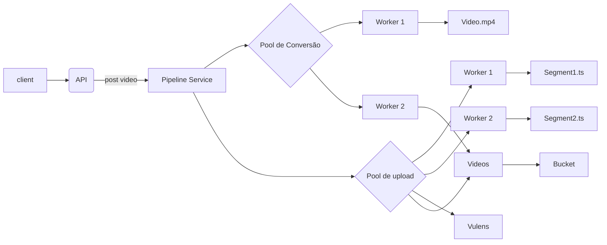
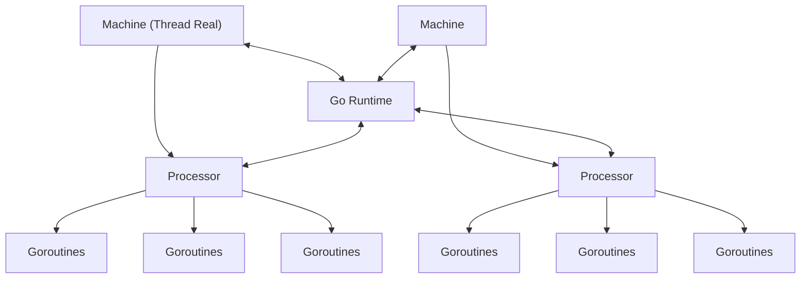

# Golang Tech Week + IA

https://github.com/devfullcycle/golangtechweek
https://github.com/ltmleo/golangtechweek

## System Design

## Arquitetura do Runtime

- Goroutines
- Channels
- Carbage Collector
- Scheduler
- Memory Allocator
- Stack Management
- Network Poller
- Reflection

## Goroutines

**Threads Virtauis vs Threads Reais**: Threads virtuais são mais leves e mais rápidas que threads reais. Uma thread real é um processo que é executado pelo sistema operacional, a linguagem de programação faz uma syscall, enquanto uma thread virtual é uma thread que é executada pelo runtime da linguagem de programação, não é necessário fazer uma syscall. 

**Goroutines**: São funções que são executadas de forma concorrente, são leves e rápidas, são executadas pelo runtime do Go. Muito mais baratas que threads reais (~2kb).

O Go trabalha com concorrência, e através delas, consegue atingir o paralelismo.

**(M:N)** M goroutines para N threads reais do sistema operacional. O go não trabalha nesse formato, ele trabalha com M:P:G.

**(M:P:G)** M threads reais para P threads virtuais para G goroutines.

**Canal**: É uma forma de comunicação entre goroutines, é uma fila de mensagens, é uma forma de sincronizar as goroutines.

**Select**: Fica ouvindo os canais, e quando um canal recebe uma mensagem, ele executa o bloco de código.

> Voce não compartilha memoria, voce usa a memoria para compartilhar.

**Close**: Fecha o canal, e não é possível enviar ou ler mais mensagens.

**Wait**: Espera todas as goroutines terminarem.

