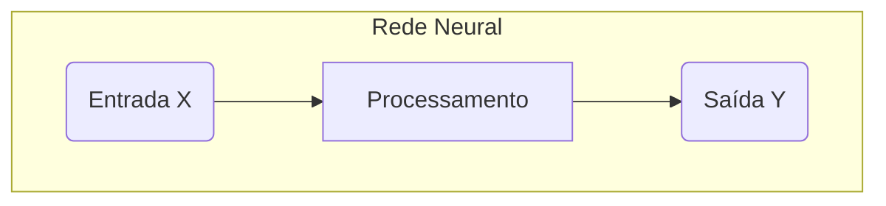
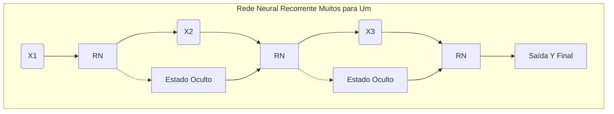
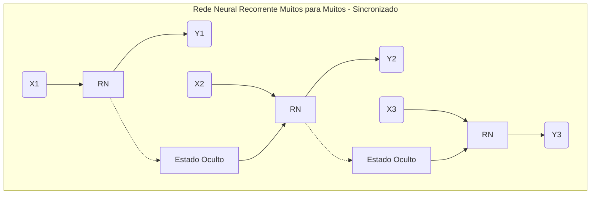
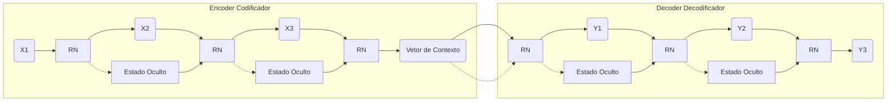

# Redes Neurais

## Redes Neurais Recorrentes (RNNs)

**Redes Neurais Recorrentes (RNNs)** são um tipo de arquitetura de *Deep Learning* (Aprendizado Profundo) projetada para processar **dados sequenciais** (como texto, áudio e séries temporais).

### Principal Característica: "Memória"
Diferentemente das Redes Neurais tradicionais (*Feedforward*), as RNNs possuem um **estado oculto** que funciona como uma espécie de **memória**. A saída de uma etapa é retroalimentada para a próxima, permitindo que a rede capture informações das entradas anteriores.

**Em outras palavras:** Ao processar uma sequência (como uma frase), o que a rede "vê" em um momento ($t$) é influenciado pelo que ela viu no momento anterior ($t-1$), garantindo que ela entenda o **contexto** e a **dependência temporal** dos dados.

### Aplicações Comuns:
* **Processamento de Linguagem Natural (PNL):** Tradução automática, análise de sentimento, modelagem de linguagem.
* **Reconhecimento de Fala:** Converter áudio em texto.
* **Séries Temporais:** Previsão de valores futuros (ex: cotações de ações, clima).

### Limitação e Evolução:
As RNNs básicas têm dificuldade em reter informações importantes ao longo de sequências muito longas (problema do "gradiente de desaparecimento"). Por isso, foram desenvolvidas variações mais robustas, como:
* **LSTM (Long Short-Term Memory):** Possuem mecanismos de "portas" (*gates*) que controlam o fluxo de informações, permitindo que a rede "lembre" e "esqueça" dados seletivamente ao longo do tempo.
* **GRU (Gated Recurrent Units):** Uma variação mais simplificada do LSTM.

### Arquiteturas de RNNs

As arquiteturas "Um para Um", "Muitos para Um" e "Muitos para Muitos" são formas de classificar as Redes Neurais Recorrentes (RNNs) com base em como elas lidam com a **sequência de entrada** e a **sequência de saída**.

A ideia principal é: **quantos passos no tempo de entrada geram quantos passos no tempo de saída?**

-----

### 1\. Um para Um (*One-to-One*)

Esta é a arquitetura mais simples, semelhante a uma Rede Neural tradicional (não recorrente), pois não depende de sequências no tempo.

  * **Entrada:** Uma única entrada $X$.
  * **Saída:** Uma única saída $Y$.
  * **Exemplo:** Classificar uma imagem (entrada) para dizer se é um gato ou cachorro (saída).
  * **Uso:** Tarefas simples de classificação onde os dados não são sequenciais.

<!-- end list -->

### 2\. Muitos para Um (*Many-to-One*)

A rede processa uma sequência de dados, mas apenas o último passo no tempo gera o resultado final.

  * **Entrada:** Uma sequência de entradas $X_1, X_2, \dots, X_T$ (ex: uma frase inteira).
  * **Saída:** Uma única saída $Y$ (ex: o sentimento da frase).
  * **Exemplo:** **Análise de Sentimento.** A entrada é uma resenha inteira ("O filme é longo, mas o final foi incrível\!"), e a saída é uma única classificação ("Positivo").
  * **Uso:** Classificação de sequências, sumarização de texto ou áudio.

<!-- end list -->

### 3\. Muitos para Muitos (*Many-to-Many*)

Esta arquitetura é a mais flexível para sequências, pois lida com sequências tanto na entrada quanto na saída. Existem duas subvariações principais:

#### A) Muitos para Muitos (Mesmo Tamanho)

O tamanho da sequência de saída é o mesmo da entrada.

  * **Entrada:** Uma sequência $X_1, X_2, \dots, X_T$.
  * **Saída:** Uma sequência $Y_1, Y_2, \dots, Y_T$.
  * **Exemplo:** **Marcação de Partes do Discurso (POS Tagging).** Para cada palavra da frase de entrada, a rede gera uma *tag* de classificação ("substantivo", "verbo", "adjetivo").
  * **Uso:** Análise de vídeo frame a frame, *tagging* de sequências.

<!-- end list -->

#### B) Muitos para Muitos (Encoder-Decoder)

O tamanho da sequência de saída **pode ser diferente** da entrada. É a arquitetura mais usada para tarefas complexas de PNL.

  * **Fase 1 (Encoder/Codificador):** Processa toda a sequência de entrada em um vetor de contexto único. (Muitos para Um).
  * **Fase 2 (Decoder/Decodificador):** Usa esse vetor de contexto para gerar a sequência de saída, passo a passo. (Um para Muitos).
  * **Exemplo:** **Tradução Automática.** A entrada é uma frase em Português (tamanho N), e a saída é a mesma frase em Inglês (tamanho M). N e M geralmente são diferentes.
  * **Uso:** Tradução, sumarização abstrata, *caption* de imagens.

<!-- end list -->

## Resumo

### Principais Tipos de Redes Neurais e Casos de Uso

| Tipo de Rede Neural | Característica Principal | Casos de Uso Principais |
|---|---|---|
| **Feedforward (MLP)** | Fluxo unidirecional, sem ciclos | Classificação simples, regressão, reconhecimento de padrões básicos |
| **CNN (Convolucionais)** | Filtros convolucionais para detectar características locais | Visão computacional, reconhecimento de imagens, detecção de objetos |
| **RNN (Recorrentes)** | Memória de estados anteriores para dados sequenciais | Processamento de linguagem natural básico, séries temporais curtas |
| **LSTM** | Controle de memória de longo prazo via gates | Tradução automática, análise de sentimento, previsão de séries temporais |
| **GRU** | Versão simplificada do LSTM | Modelagem de sequências quando LSTM é muito complexo |
| **Transformer** | Mecanismo de atenção, processamento paralelo | Modelos de linguagem (GPT, BERT), tradução avançada |
| **GAN** | Duas redes competindo (Gerador vs Discriminador) | Geração de imagens, criação de conteúdo sintético |
| **Autoencoder** | Compressão e reconstrução de dados | Redução de dimensionalidade, detecção de anomalias |

### Arquiteturas RNN por Entrada/Saída

| Arquitetura | Entrada | Saída | Exemplo de Uso |
|---|---|---|---|
| **Um para Um** | Única | Única | Classificação de imagem |
| **Muitos para Um** | Sequência | Única | Análise de sentimento |
| **Um para Muitos** | Única | Sequência | Geração de legendas para imagem |
| **Muitos para Muitos (Sync)** | Sequência | Sequência (mesmo tamanho) | POS tagging, análise de vídeo |
| **Muitos para Muitos (Async)** | Sequência | Sequência (tamanho diferente) | Tradução automática, sumarização |

