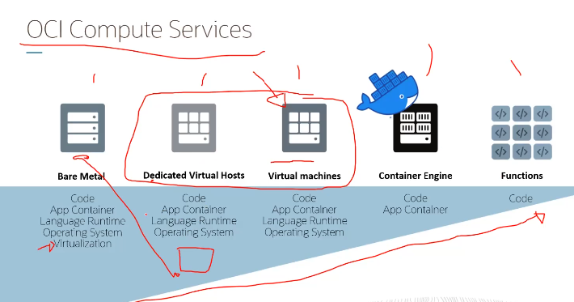

# Compute Services

Computer instances são baseadas em shapes (CPU, Memoria e Storage) e são executadas em instâncias virtuais (VMs), em hardware dedicado (Bare Metal) ou Deticated VM Hosts.

- **Virtual Machines**: VMs são instâncias de computação que rodam em hardware compartilhado. São altamente seguras. Não necessitam de toda máquina física para serem executadas.
- **Bar Metal**: São instâncias de computação que rodam em hardware dedicado. São altamente seguras. Necessitam de toda máquina física para serem executadas. Ideal para aplicações que necessitam de alto desempenho.
- **Deticated VM Hosts**: São instâncias de computação que rodam em hardware dedicado ou VM host dedicado. São altamente seguras. Necessitam de toda máquina física para serem executadas. Ideal para VMS mas atenção em termos de performance.

## Shapes

**Shapes**: Shapes são templates que determinam o número de CPUs, quantidade de memória e capacidade de armazenamento de uma instância. Shapes são classificados em Standard, DenseIO, GPU, HPC e Optimized. Existem dois tipos de shapes:

- **Flex**: Permite que você escolha o número de CPUs e a quantidade de memória.
- **Fixed**: Oferece um número fixo de CPUs e memória.

### Instance Configuration

No serviço Oracle Cloud Infrastructure Compute, uma Instance Configuration é uma configuração predefinida que inclui o formato, a imagem base e os metadados da instância. Ela permite que os usuários criem rapidamente novas instâncias com a mesma configuração, simplificando o processo de implantação.

## Scaling

Scaling é o processo de aumentar ou diminuir a capacidade de uma instância. Pode ser feito de duas formas: Vertical Scaling e Horizontal Scaling.

### Vertical Scaling

Vertical Scaling é o processo de aumentar ou diminuir a capacidade de uma instância. Você pode aumentar ou diminuir a capacidade de uma instância ao alterar o shape da instância. Fazendo um **scale up** ou **scale down**.

### Horizontal Scaling

Horizontal Scaling é o processo de aumentar ou diminuir o número de instâncias. Você pode aumentar ou diminuir o número de instâncias ao adicionar ou remover instâncias. Fazendo um **scale out** ou **scale in**. Podem ser feitos manualmente ou automaticamente baseado em métricas de monitoramento, ou em horários pré-definidos.

## Preemptible Instances

Preemptible instances são instâncias que podem ser interrompidas a qualquer momento. São ideais para workloads que podem ser interrompidos e reiniciados sem perda de dados. São mais baratas que as instâncias padrão.

## Instance Basics

- **VNICS**: Virtual Network Interface Cards. Cada instância possui uma ou mais VNICS. Cada VNIC é conectada a uma sub-rede.
- **Remote Storage**: Armazenamento remoto que pode ser anexado a uma instância. Pode ser usado para armazenar dados persistentes.
  - **Boot Volume**: Volume que contém o sistema operacional da instância.
  - **Block Volume**: Volume de armazenamento adicional que pode ser anexado a uma instância.

## OKE - Oracle Kubernetes Engine

O Oracle Kubernetes Engine (OKE) é um serviço de contêiner gerenciado que permite que você execute aplicativos em contêineres em um ambiente de nuvem gerenciado. O OKE é baseado no Kubernetes, um sistema de código aberto para automatizar a implantação, o dimensionamento e a operação de aplicativos em contêineres.

Oracle gerencia o controle plane e os nós do Kubernetes para você. Você só precisa se preocupar com os nodepools e pods.

- **Basic Clusters**: Possuem todas funcionalidades do Kubernetes e do OKE.
- **Enhanced Clusters**: Possuem todas funcionalidades do Basic Clusters e funcionalidades adicionais como:
  - **Virtual Nodes**: Nodes que são executados em um ambiente gerenciado pela Oracle. Experiencia Serverless.

## Container Instances

Container instances são instâncias de computação que rodam contêineres. São ideais para aplicações que são executadas em contêineres. São altamente seguras. Não necessitam de toda máquina física para serem executadas.

## Serverless Functions

Serverless Functions são funções de computação que são executadas em um ambiente gerenciado pela Oracle. Você só paga pelo tempo que a função é executada. São ideais para aplicações que são executadas em funções de computação. São altamente seguras. Não necessitam de toda máquina física para serem executadas.

- **Function as a Service (FaaS)**: é um modelo de computação sem servidor que permite que você execute funções de computação sem precisar gerenciar a infraestrutura. Você só paga pelo tempo que a função é executada.
- **Event driven Architecture**: Arquitetura de computação que responde a eventos. As funções são executadas em resposta a eventos.
- **Pay per use**: Você só paga pelo tempo que a função é executada.
- **Functions triggers**: Eventos que acionam a execução de uma função. Invocação direta (SDK, CLI, API) ou OCI events (OCI services, Cloud Events, etc.).
- **Function integrations**: Monitoring, Identity, Registry, Logging, Networking, OCI services, etc.

Push container to registry -> configure function trigger -> function is executed in response to trigger. -> pay for execution time.

