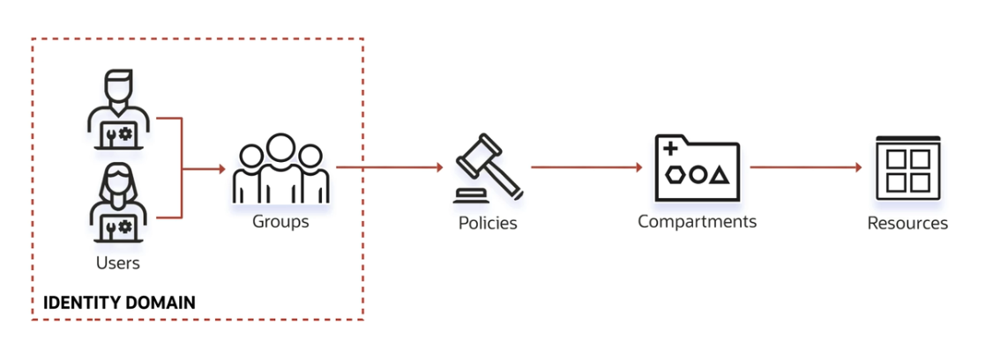

# IAM - Identity and Access Management

O **IAM** é um serviço que permite gerenciar quem tem acesso aos recursos da Oracle Cloud e o que eles podem fazer com esses recursos.

Fine-grained access control é uma característica do IAM que permite controlar o acesso a recursos individuais. Por exemplo, você pode conceder a um usuário acesso de leitura a um bucket de armazenamento específico, mas não a outros buckets.

AuthN e AuthZ são dois conceitos importantes do IAM:

- **AuthN**: Autenticação é o processo de verificar a identidade de um usuário.
- **AuthZ**: Autorização é o processo de determinar se um usuário tem permissão para acessar um recurso.

## OCI Identity Concepts

### Identity Domains

Um domínio de identidade é uma coleção de usuários que compartilham um conjunto comum de políticas. Cada domínio de identidade tem um conjunto de políticas que controlam o acesso dos usuários aos recursos da Oracle Cloud.



- **Users**: Representam pessoas que precisam acessar a Oracle Cloud. Cada usuário tem um nome de usuário e uma senha.
- **Policies**: Define quem pode acessar quais recursos e como eles podem acessá-los. Policies possuem Role Based Access Control (RBAC).


### Oracle Cloud ID (OCID)

O Oracle Cloud ID (OCID) é um identificador exclusivo para todos os recursos da Oracle Cloud. Cada recurso tem um OCID exclusivo que não muda durante a vida útil do recurso. A oracle gere OCIDs para todos os recursos da Oracle Cloud.

```plaintext
ocid1.<resource_type>.<realm>.[region][.future_use].<unique_ID>
ex. 
tenancy: ocid1.tenancy.oc1..aaaaaaaaxxxxxxxx
Block Volume: ocid1.volume.oc1.eu-frankfurt-1.aaaaaaaaxxxxxxxx
```
- ocid1: tipo de recurso
- resource_type: Tipo de recurso (ex. Compute Instance, Block Storage, etc.)
- realm: Set de regiões que compartilham as mesmas características (ex. Commercial, Government, etc.)
- region: Região onde o recurso está localizado
- unique_ID: Identificador único do recurso

### Compartments

Compartments são contêineres lógicos que ajudam a organizar e isolar os recursos da Oracle Cloud. Você pode criar compartimentos para organizar recursos por projeto, equipe, aplicativo ou ambiente. Coleções de recursos relacionados são colocadas em um compartimento. Podem ser usados para isolamento e controle de acesso.

::: note
O compartimento root é o tenancy, que é criado automaticamente quando você se inscreve na Oracle Cloud.
O root pode conter todos os recursos da Oracle Cloud.
Por boas práticas, crie compartimentos para organizar e isolar recursos.
:::

Cada recurso pode pertencer a apenas um compartimento. Compartimentos podem conter outros compartimentos, formando uma hierarquia de compartimentos (podem ter até 6).

Grupos + Policies são usados para controlar o acesso aos recursos em um compartimento.

Recursos podem interagir com recursos em outros compartimentos, mas você deve conceder permissões explícitas para permitir essa interação.

Recursos em um compartimento podem ser movidos para outro compartimento.

Recursos de múltiplas regiões podem ser colocados em um mesmo compartimento.

Pode-se setar quotas e budgets em um compartimento.

### AuthN and AuthZ

- **AuthN**: Autenticação é o processo de verificar a identidade de um usuário.
  - **Users**: Representam pessoas que precisam acessar a Oracle Cloud. Cada usuário tem um nome de usuário e uma senha.
  - **Groups**: Coleção de usuários. Permite aplicar políticas a um grupo de usuários.
  - **API Keys**: Chave de autenticação para acessar a Oracle Cloud via API.
  - **Authentication tokens**: Token de autenticação para acessar a Oracle Cloud via API.
- **AuthZ**: Autorização é o processo de determinar se um usuário tem permissão para acessar um recurso.
  - **Policies**: definições human readable que especificam quem pode acessar quais recursos e como. São compostas por regras que são avaliadas para determinar se um acesso é permitido ou negado.

``` plaintext
Allow group <group_name> to <verb> <resource-type> in <location> where <conditions>
```

## Tenancy

Tenancy é o nível mais alto da hierarquia de recursos da Oracle Cloud. Quando você se inscreve na Oracle Cloud, a Oracle cria um tenancy para você. O tenancy é um contêiner lógico para todos os recursos da Oracle Cloud que você cria.

- **Tenancy Admin**: Usuário que tem permissões para gerenciar recursos no tenancy. Criador da conta Oracle Cloud. Boa prática: criar um usuário separado para gerenciar o tenancy.
- **OCI Admin**: Usuário que tem permissões para gerenciar recursos na Oracle Cloud. Pode ser um usuário do tenancy ou um usuário federado.
- **OCI Admin Groups**: Grupos de usuários que têm permissões para gerenciar recursos na Oracle Cloud. Pode ser um grupo de usuários do tenancy ou um grupo de usuários federados.
- **OCI Admin Policies**: Políticas que concedem permissões a usuários e grupos para gerenciar recursos na Oracle Cloud. Boa prática: criar compartimentos dedicados para organizar recursos.
