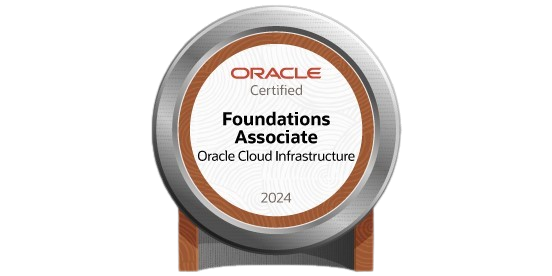
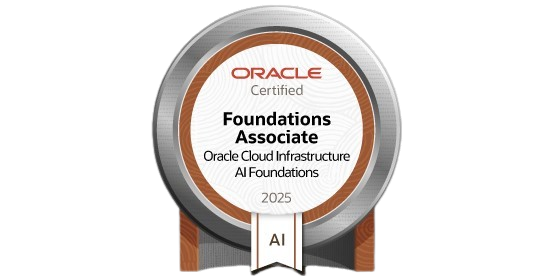

# Oracle Cloud Introduction

  
  

- **OCI**: Oracle Cloud Infrastructure

## Oracle Cloud Infrastructure (OCI)
- **Compute**: Virtual Machines, Bare Metal, Container Engine, Functions
- **Storage**: Block Volume, Object Storage, File Storage, Archive Storage
- **Networking**: VCN, Load Balancer, FastConnect, DNS, VPN
- **Database**: Autonomous Database, Exadata Cloud Service, MySQL, NoSQL, etc.
- **Native Vmware Solution**: VMware Solution on OCI
- **Developer Services**: Developer Cloud, API Gateway, Functions, etc.
- **Containers and Functions**: Container Engine, Functions
- **Machine Learning and AI**: Data Science, AI, etc.
- **Data Lakehouse**: Big Data, Data Integration, Data Flow, etc.
- **Analytics and BI**: Analytics, Data Integration, Data Flow, etc.

Todas as camadas possuem **Segurança**, **Observabilidade**, **Governança** e **Gerenciamento de Custos**.

## Oracle Cloud Applications

- Enterprise Resource Planning
- Human Capital Management
- Customer Experience
- Supply Chain Management
- Advertising and Customer Experience
- Industry Applications
- ISV and custom applications

## OCI Architecture

- **Region**: Uma região é um local geograficamente distinto que contém um ou mais Availability Domains (ADs).
- **Availability Domain (AD)**: Um AD é um data center independente com alimentação, resfriamento e conectividade redundantes. Conectados entre si por uma rede de baixa latência e alta largura de banda.
- **Fault Domain**: Um Fault Domain é uma coleção de hardware e infraestrutura de software dentro de um AD. Cada AD tem três ou mais Fault Domains. Protege contra falhas de hardware e software inesperadas.

FDs agem como um data center logico dentro de um AD. FDs são isolados uns dos outros, portanto, uma falha em um FD não afeta os outros FDs em um AD.

### Escolhendo uma região

- **Proximidade**: Escolha uma região próxima aos seus usuários finais, para reduzir a latência e melhorar o desempenho.
- **Data Residency**: Alguns países possuem leis que exigem que os dados dos cidadãos sejam armazenados no país. Escolha uma região que atenda a esses requisitos.
- **Recursos**: Nem todas as regiões possuem todos os recursos. Verifique a disponibilidade dos recursos na região escolhida.

### Availability Domains

Isolados uns dos outros, portanto, uma falha em um AD não afeta os outros ADs em uma região. Muito pouco provável que dois ADs falhem ao mesmo tempo. A infraestrutura física nao é compartilhada entre ADs.

:::note
Uma região OCI é composta de um ou mais domínios de disponibilidade isolados e interconectados. Cada domínio de disponibilidade é um local físico separado dentro de uma região. O número de domínios de disponibilidade por região pode variar; algumas regiões OCI têm três domínios de disponibilidade, enquanto outras têm um único domínio de disponibilidade.
:::

### Fault Domains
Grupo de hardware e infraestrutura de software dentro de um AD. Cada AD tem três ou mais FDs. Protege contra falhas de hardware e software inesperadas e contra falhas planejadas, como atualizações de software.

Voce pode escolher o fault domain onde sua instância será provisionada. Se não fizer nenhuma escolha, o Oracle escolherá um FD para você, garantindo que suas instâncias sejam distribuídas em diferentes FDs. 

Voce pode mudar o FD de uma instancia editando o fault domain, para bare metal ou VM DB System instance, precisa terminar a instancia e depois lançar ela em um novo FD.

## Pricing

- **Pay as you go**: Pague pelo que você usa.
- **Annual Flex**: Anual, com desconto. Minimo de 1 ano. Comprometer-se com um valor minimo de gasto de $2k.

Preço na OCI é global, não varia de região para região.

Fatores que afetam o preço:

- Tamanho de recursos
- Tipo de recursos
- Data transfer (No ingress cost, carefull with egress cost)
- All OCI regions have the same pricing

Na calculadora de preço, voce pode ver o custo de cada recurso, o custo total e custos de arquiteturas pre-definidas.

Os modelos de preços suportados no OCI incluem:

- Pay As You Go: Pague conforme o uso.
- Oracle Universal Credits: Créditos que podem ser usados em qualquer serviço OCI.
- Bring Your Own License (BYOL): Use suas licenças Oracle existentes no OCI.

No Oracle Cloud Infrastructure, você pode configurar alertas de e-mail para receber notificações quando os limites de orçamento forem atingidos. Esses alertas ajudam os clientes a se manterem informados sobre seus gastos e a tomarem as ações apropriadas para gerenciar seus custos.

No OCI, a transferência de dados de entrada (dados que entram no OCI pela internet) é normalmente gratuita. No entanto, a transferência de dados de saída (dados que saem do OCI para a internet) é cobrada após os primeiros 10 TB/mês, dependendo da região e do destino específicos.

## Cost Analysis

Cost Analysis é uma ferramenta de visualização fácil de usar para ajudar você a rastrear e otimizar seus gastos com Oracle Cloud Infrastructure. Você pode gerar gráficos e baixar relatórios tabulares precisos e confiáveis ​​de dados de custo agregados sobre seu consumo de Oracle Cloud Infrastructure.

## Usage Report

Um relatório de custo é um arquivo de valor separado por vírgula (CSV) que é semelhante a um relatório de uso, mas também inclui colunas de custo. O relatório pode ser usado para obter um detalhamento dos itens de linha da sua fatura na granularidade do nível do recurso. Como resultado, você pode otimizar seus gastos com o Oracle Cloud Infrastructure e tomar decisões de gastos com a nuvem mais informadas.

## Quotas and Limits

Os limites de serviço são os limites superiores colocados pela Oracle no número de recursos que você pode criar em uma região ou tenancy.

As cotas de compartimento são os limites superiores definidos pelos usuários para uso de recursos dentro de compartimentos específicos. 

A distinção é que os limites de serviço são definidos pela Oracle e se aplicam a uma tenancy em uma região, enquanto as cotas de compartimento são definidas pelos usuários e se aplicam a compartimentos específicos.

No Oracle Cloud Infrastructure, as cotas de compartimento são aplicadas por compartimento. Isso permite que os administradores definam diferentes limites de recursos para cada compartimento, garantindo que o uso de recursos esteja alinhado com as políticas e requisitos da organização.