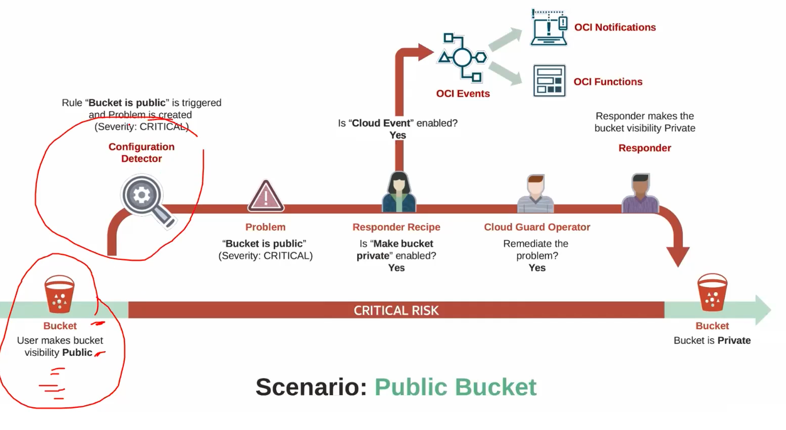

# Security Services

Modelos de segurança compartilhada o que significa que a Oracle é responsável pela segurança da infraestrutura e você é responsável pela segurança dos seus dados e aplicações.

No modelo de responsabilidade de segurança compartilhada da OCI, a Oracle é responsável por proteger a infraestrutura de nuvem subjacente. Isso inclui proteger os data centers físicos, a infraestrutura de rede e o hardware que dão suporte aos serviços de nuvem, garantindo um ambiente seguro e confiável para os clientes implantarem seus aplicativos e armazenarem dados

- **Detecção e remediação de ameaças**
  - **Cloud Guard**: Detecta e responde a ameaças de segurança.
  - **Security Zones**: Isola recursos e aplicações.
  - **Threat Intelligence**: Proteção contra ameaças.
  - **Vulnerability Scanning**: Identifica e corrige vulnerabilidades.
- **Proteção de dados**
  - **Vault key Management**: Gerenciamento de chaves de criptografia.
  - **Vault Secrets Management**: Gerenciamento de segredos.
  - **Data Safe**: Proteção de dados.
  - **Certificate Service**: Gerenciamento de certificados.
- **Proteção de OS e Workload**
  - **Shielded Instances**: Proteção de instâncias.
  - **Dedicatd VM Hosts**: Proteção de VMs.
  - **Bastion**: Acesso seguro a instâncias.
  - **OS Management Service**: Gerenciamento de sistemas operacionais.
- **Gerenciamento de Identidade e Acesso**
  - **IAM**: Gerenciamento de identidade e acesso.
  - **MFA**: Autenticação de múltiplos fatores.
  - **Federação**: Gerenciamento de identidade.
  - **Audit**: Auditoria de segurança.
- **Proteção de infraestrutura**
  - **DDoS Protection**: Proteção contra ataques DDoS.
  - **WAF**: Proteção contra ataques web.
  - **Secutity Lists/NSGs**: Listas de segurança.
  - **Network Firewall**: Proteção de rede.

## Cloud Guard

Detecta e responde a ameaças de segurança. Monitora a segurança da sua nuvem e aplica as melhores práticas de segurança. Detecta ameaças e responde a elas. Protege contra ameaças de segurança.

O Oracle Cloud Guard é um serviço de segurança nativo da nuvem gratuito para monitorar a postura de segurança de uma locação OCI e fornecer notificação ou correção do problema. Existem quatro componentes principais do Cloud Guard; um **target** a ser inspecionado, um **detector** usada para inspecionar o alvo, um **problem** como a saída de um evento detectado dentro de um alvo e uma função de **responders** para agir sobre o problema.

O Oracle Cloud Guard tem três componentes principais: **detectores**, **problemas** e **respondedores**. Os detectores monitoram continuamente sua infraestrutura, procurando por problemas potenciais. Problemas são os riscos de segurança e questões que os detectores identificam. Respondedores são as ações automáticas ou manuais tomadas para resolver os problemas identificados. Alvos não são um componente do Oracle Cloud Guard.

## Vault

O propósito principal do serviço OCI Vault é armazenar e gerenciar chaves de criptografia e segredos. O serviço Vault ajuda você a armazenar, gerenciar e controlar com segurança o acesso a chaves de criptografia, segredos e certificados, garantindo a proteção de dados confidenciais.

O Key Management Service é um serviço OCI que armazena e gerencia chaves para acesso seguro a recursos.

O Oracle Cloud Infrastructure (OCI) Key Management Service (KMS) é um serviço baseado em nuvem que fornece gerenciamento e controle centralizados de chaves de criptografia para dados armazenados no OCI.

O OCI KMS tem os seguintes recursos:

- Simplifica o gerenciamento de chaves armazenando e gerenciando chaves de criptografia centralmente.
Protege dados em repouso e em trânsito, oferecendo suporte a vários tipos de chaves de criptografia, incluindo chaves simétricas e chaves assimétricas.
- Atende aos requisitos de segurança e conformidade, dando a você mais controle para Bring Your Own Keys (BYOK) para OCI, criá-las no OCI ou Hold Your Own Keys (HYOK) externo ao OCI. Você também pode usar módulos de segurança de hardware (HSMs) certificados pelo FIPS 140-2 Nível 3 para armazenar e proteger suas chaves de criptografia.
- Integre a criptografia com outros serviços OCI, como armazenamento, banco de dados, Fusion Applications para proteger dados armazenados nesses serviços.

### Vaults
Os cofres são entidades lógicas onde o serviço Vault cria e armazena de forma durável chaves e segredos do cofre. O tipo de cofre que você tem determina recursos e funcionalidades, como graus de isolamento de armazenamento, acesso ao gerenciamento e criptografia, escalabilidade e capacidade de fazer backup. O tipo de cofre que você tem também afeta o preço. Você não pode alterar o tipo de um cofre depois de criá-lo.

Componentes:

- **Vaults**: Entidades lógicas onde o serviço Vault cria e armazena chaves e segredos de forma durável.
- **Keys**: Chaves de criptografia usadas para criptografar e descriptografar dados.
- **Secrets**: Dados sensíveis, como senhas, chaves de API e certificados, que são armazenados e gerenciados de forma segura.
- **Key Versions & Rotations**: Versões de chaves e rotação de chaves.
- **Automatic Key Rotation**: Rotação automática de chaves.
- **HARDWARE SECURITY MODULES**: Módulos de segurança de hardware (HSMs) certificados pelo FIPS 140-2 Nível 3 para armazenar e proteger chaves de criptografia.
- **ENVELOPE ENCRYPTION**: Criptografia de envelope para proteger dados em repouso e em trânsito.
- **SECRET VERSIONS**: Cada segredo é automaticamente versionado para que você possa recuperar versões anteriores de um segredo.
- **SECRET BUNDLES**: Um pacote secreto do vault consiste no conteúdo secreto, propriedades do segredo e versão secreta (como número da versão ou estado de rotação) e metadados contextuais fornecidos pelo usuário para o segredo. Quando você rotaciona um segredo, você cria uma nova versão secreta, que também inclui uma nova versão do pacote secreto.

## Security Zones

A principal vantagem de usar OCI Security Zones ao implantar recursos em seu ambiente de nuvem é garantir a adesão às melhores práticas e políticas de segurança. Security Zones ajudam a manter uma postura de segurança forte ao impor automaticamente políticas de segurança predefinidas dentro de compartimentos designados, evitando a criação de recursos não compatíveis.

As Zonas de Segurança permitem que você tenha certeza de que seus recursos no Oracle Cloud Infrastructure, incluindo recursos de Computação, Rede, Armazenamento de Objetos, Volume de Bloco e Banco de Dados, estejam em conformidade com suas políticas de segurança.

Uma zona de segurança é associada a um ou mais compartimentos e uma receita de zona de segurança. Quando você cria e atualiza recursos em uma zona de segurança, o Oracle Cloud Infrastructure valida essas operações em relação à lista de políticas definidas na receita de zona de segurança. Se qualquer política de zona de segurança for violada, a operação será negada. Por padrão, um compartimento e quaisquer subcompartimentos estão na mesma zona de segurança, mas você também pode criar uma zona de segurança diferente para um subcompartimento.