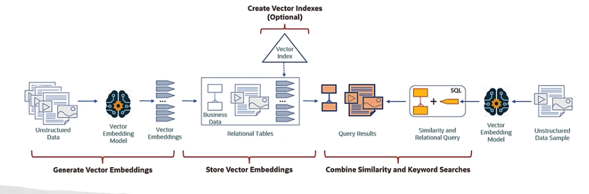

# Vector Search

Busca vetorial é uma técnica avançada de busca que utiliza representações vetoriais de dados para encontrar itens semelhantes com base em suas características semânticas. Em vez de depender apenas de palavras-chave, a busca vetorial analisa a relação entre os dados em um espaço multidimensional, permitindo resultados mais precisos e relevantes.

## Vector Data Type

O tipo de dado vetorial é uma estrutura que armazena vetores, que são representações numéricas de dados em um espaço multidimensional. Cada vetor é composto por uma série de valores (componentes) que representam características específicas do item. Esses vetores podem ser usados para calcular similaridades entre diferentes itens, facilitando a busca por itens semelhantes.

## Vector Embedding

Vector embedding é o processo de transformar dados, como texto, imagens ou áudio, em vetores numéricos. Essa transformação é realizada por meio de técnicas de aprendizado de máquina, como redes neurais, que capturam as características semânticas dos dados. Os embeddings permitem que os dados sejam comparados e analisados em um espaço vetorial, facilitando a busca e a recuperação de informações relevantes.

## Similarity Search

A busca por similaridade é uma técnica utilizada para encontrar itens que são semanticamente semelhantes a um item de consulta. Em vez de buscar por correspondências exatas, a busca por similaridade utiliza medidas matemáticas, como a distância euclidiana ou a similaridade do cosseno, para avaliar o quão próximos os vetores estão uns dos outros no espaço multidimensional. Isso permite identificar itens que compartilham características semelhantes, mesmo que não sejam idênticos.

## Generate Vector Embeddings

Para gerar embeddings vetoriais, é necessário utilizar modelos de aprendizado de máquina treinados em grandes conjuntos de dados. Esses modelos podem ser pré-treinados ou personalizados para atender a necessidades específicas. O processo geralmente envolve os seguintes passos:

1. **Coleta de Dados**: Reunir um grande conjunto de dados representativos do domínio de interesse.
2. **Pré-processamento**: Limpar e preparar os dados para treinamento, incluindo a normalização e a transformação em um formato adequado.
3. **Treinamento do Modelo**: Utilizar técnicas de aprendizado de máquina, como redes neurais, para treinar um modelo que possa gerar embeddings a partir dos dados de entrada.
4. **Geração de Embeddings**: Aplicar o modelo treinado a novos dados para gerar seus embeddings vetoriais.

## Store Vector Embeddings

Os embeddings vetoriais podem ser armazenados em bancos de dados especializados que suportam operações de busca vetorial. Esses bancos de dados são otimizados para lidar com grandes volumes de dados e realizar buscas eficientes com base em similaridade. 

Na OCI temos o Oracle Database 23ai.

## Vector Indexes

Índices vetoriais são estruturas de dados que facilitam a busca eficiente em grandes conjuntos de embeddings vetoriais. Eles organizam os vetores de maneira que as operações de busca por similaridade possam ser realizadas rapidamente, reduzindo o tempo necessário para encontrar itens semelhantes. Existem vários tipos de índices vetoriais, como árvores KD, índices HNSW (Hierarchical Navigable Small World) e índices FAISS (Facebook AI Similarity Search), cada um com suas próprias vantagens e desvantagens dependendo do caso de uso.

## Query Data With Similarity Search

Para consultar dados usando busca por similaridade, o processo geralmente envolve os seguintes passos:

1. **Preparação da Consulta**: Transformar a consulta do usuário em um vetor usando o mesmo modelo de embedding utilizado para os dados armazenados.
2. **Busca por Similaridade**: Utilizar o índice vetorial para encontrar os embeddings mais próximos do vetor da consulta. Isso pode envolver o uso de técnicas como busca aproximada de vizinhos mais próximos (ANN) para melhorar a eficiência.
3. **Recuperação de Resultados**: Extrair os itens correspondentes aos embeddings encontrados e apresentá-los ao usuário como resultados da busca.
4. **Classificação e Filtragem**: Opcionalmente, classificar os resultados com base em critérios adicionais ou aplicar filtros para refinar a lista de itens retornados.

