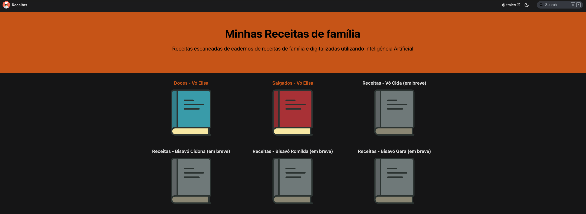

# Receitas

Sites de receitas de família, criado com auxilio de IA para preservar e compartilhar memórias afetivas. Abaixo, exploro um pouco mais sobre o projeto e como ele foi desenvolvido.

https://ltmleo.github.io/receitas/

## Sobre o projeto

O projeto "Receitas" é uma iniciativa para preservar e compartilhar receitas de família, utilizando inteligência artificial para auxiliar na organização e apresentação das informações. A ideia é criar um repositório digital onde as receitas possam ser facilmente acessadas e apreciadas por todos os membros da família.

## Tecnologias utilizadas

- **Google Drive**: Utilizado para escanear os livros de receitas e armazenar as imagens digitalizadas em pdf.
- **Docussaurus**: Utilizado para a criação e organização do conteúdo do site.
- **Markdown**: Formato de escrita utilizado para estruturar o conteúdo das receitas.
- **GitHub**: Plataforma utilizada para versionamento e hospedagem do projeto.
- **Gemini**: Inteligência artificial utilizada para transcrever as receitas para markdown.
- **Python**: Linguagem de programação utilizada para automatizar o processo de transcrição e organização das receitas.

## Features

- É possível ver a receita transcrita e documento original lado a lado.
- É possível utilizar o mecanismo de busca para encontrar receitas e ingredientes específicos.
- É possível navegar pelas paginas da mesma forma que se navega em um livro.

## Evolução do projeto

Esse projeto ainda não está completo, a ideia é ao longo do tempo, escanear outros livros de receitas. 